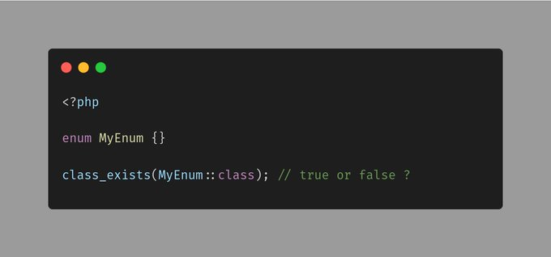

.. _class_exists()-with-enums:

class_exists() With Enums
-------------------------

.. meta::
	:description:
		class_exists() With Enums: In PHP, there is:.
	:twitter:card: summary_large_image
	:twitter:site: @exakat
	:twitter:title: class_exists() With Enums
	:twitter:description: class_exists() With Enums: In PHP, there is:
	:twitter:creator: @exakat
	:twitter:image:src: https://php-tips.readthedocs.io/en/latest/_images/enum_exists.png
	:og:image: https://php-tips.readthedocs.io/en/latest/_images/enum_exists.png
	:og:title: class_exists() With Enums
	:og:type: article
	:og:description: In PHP, there is:
	:og:url: https://php-tips.readthedocs.io/en/latest/tips/enum_exists.html
	:og:locale: en

.. raw:: html

	

In PHP, there is:

- ``class_exists()``

- ``trait_exists()``

- ``interface_exists()``

- ``enum_exists()``

What would the code here produce?

This is displaying true. Enumerations are considered as classes, even as they have some limitations compared to normal classes.

See Also
________

* `enum_exists <https://www.php.net/manual/en/function.enum-exists.php>`_
* `All Classes Aliases <https://php-tips.readthedocs.io/en/latest/tips/class_alias_alias.html>`_
* `Does MyEnum exists? <https://3v4l.org/iU1v46>`_ [Try me]

PHP Error Messages
__________________

PHP Features
____________

* `enum <https://php-dictionary.readthedocs.io/en/latest/dictionary/enum.ini.html>`_

* `class <https://php-dictionary.readthedocs.io/en/latest/dictionary/class.ini.html>`_

* `trait <https://php-dictionary.readthedocs.io/en/latest/dictionary/trait.ini.html>`_

* `interface <https://php-dictionary.readthedocs.io/en/latest/dictionary/interface.ini.html>`_

