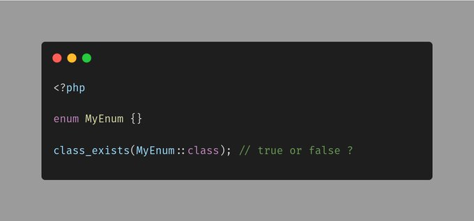

.. _class_exists()-with-enums:

class_exists() With Enums
-------------------------

	.. meta::
		:description lang=en:
			class_exists() With Enums: In PHP, we have:
- class_exists()
- trait_exists()
- interface_exists()
- enum_exists()

What would you expect as a result here.

By `Jan Nedbal <https://twitter.com/janedbal>`_

In PHP, we have:

- class_exists()

- trait_exists()

- interface_exists()

- enum_exists()

What would you expect as a result here?

This is displaying true. 

* `enum_exists <https://www.php.net/manual/en/function.enum-exists.php>`_
* `All Classes Aliases <https://php-tips.readthedocs.io/en/latest/tips/class_alias_alias.html>`_

