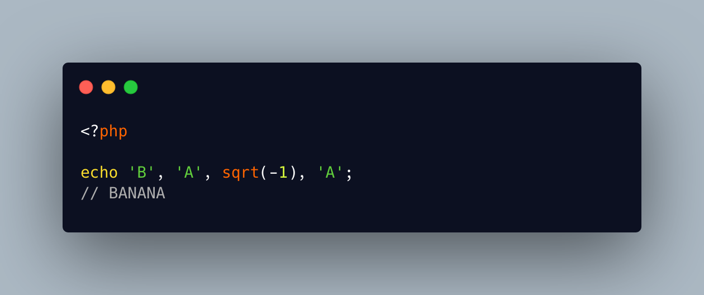

.. _reusing-decimals-for-bananas:

Reusing Decimals For Bananas
----------------------------

.. meta::
	:description:
		Reusing Decimals For Bananas: Besides decimal numbers such as ``8.
	:twitter:card: summary_large_image
	:twitter:site: @exakat
	:twitter:title: Reusing Decimals For Bananas
	:twitter:description: Reusing Decimals For Bananas: Besides decimal numbers such as ``8
	:twitter:creator: @exakat
	:twitter:image:src: https://php-tips.readthedocs.io/en/latest/_images/errorNumber.png
	:og:image: https://php-tips.readthedocs.io/en/latest/_images/errorNumber.png
	:og:title: Reusing Decimals For Bananas
	:og:type: article
	:og:description: Besides decimal numbers such as ``8
	:og:url: https://php-tips.readthedocs.io/en/latest/tips/errorNumber.html
	:og:locale: en

.. raw:: html

	

Besides decimal numbers such as ``8.53`` or ``3.141592654``, PHP has 2 extra decimal numbers: ``INF``, for infinity and ``NAN`` for not a number. Both of them default to the eponymous string, when displayed. This might be useful.

This trick also works for ``Array``, with some error suppression, or not-too-recent PHP version. ``Object`` generates a Fatal error, and ``Resource`` displays something that can't be reused to build another human readable word: ``Resource id #1``: bummer.

See Also
________

* `Original trigger <https://bsky.app/profile/lecodeestdanslepre.fr/post/3mel4s5kmws2u>`_
* `NAN and INF for BANANA <https://3v4l.org/nFSZj>`_ [Try me]

PHP Error Messages
__________________

* `Object of class stdClass could not be converted to string <https://php-errors.readthedocs.io/en/latest/messages/object-of-class-%25s-could-not-be-converted-to-string.html>`_

PHP Features
____________

* `float <https://php-dictionary.readthedocs.io/en/latest/dictionary/float.ini.html>`_

* `nan <https://php-dictionary.readthedocs.io/en/latest/dictionary/nan.ini.html>`_

* `inf <https://php-dictionary.readthedocs.io/en/latest/dictionary/inf.ini.html>`_

