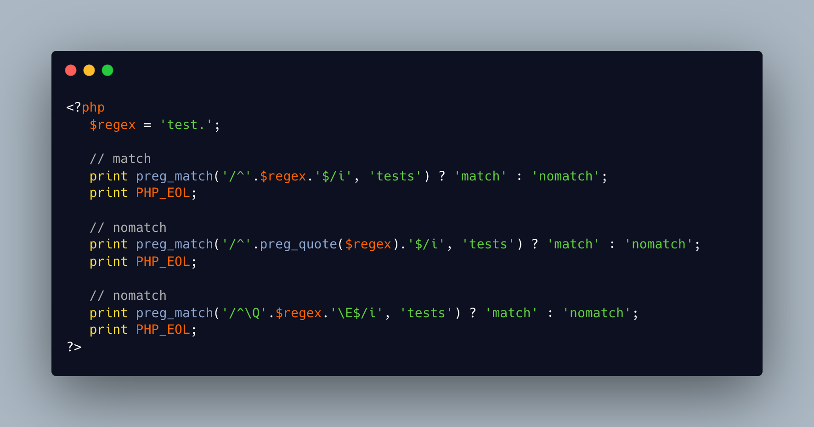

.. _escaping-a-regex:

Escaping A Regex
----------------

.. meta::
	:description:
		Escaping A Regex: To use literal characters inside a regex, it is possible to use preg_quote(): it adds a backslash before every special character in the string.
	:twitter:card: summary_large_image
	:twitter:site: @exakat
	:twitter:title: Escaping A Regex
	:twitter:description: Escaping A Regex: To use literal characters inside a regex, it is possible to use preg_quote(): it adds a backslash before every special character in the string
	:twitter:creator: @exakat
	:twitter:image:src: https://php-tips.readthedocs.io/en/latest/_images/escaped_regex.png.png
	:og:image: https://php-tips.readthedocs.io/en/latest/_images/escaped_regex.png
	:og:title: Escaping A Regex
	:og:type: article
	:og:description: To use literal characters inside a regex, it is possible to use preg_quote(): it adds a backslash before every special character in the string
	:og:url: https://php-tips.readthedocs.io/en/latest/tips/escaped_regex.html
	:og:locale: en

To use literal characters inside a regex, it is possible to use preg_quote(): it adds a backslash before every special character in the string. Don't forget to use the second argument, which can hold any arbitrary delimiter.

Another option is to use the ``\Q`` and ``\E`` characters inside the regex: it turns all the special characters into a literal value.

* `Escape sequences (PHP manual) <https://www.php.net/manual/en/regexp.reference.escape.php>`_
* `preg_quote <https://www.php.net/manual/en/function.preg-quote.php>`_

