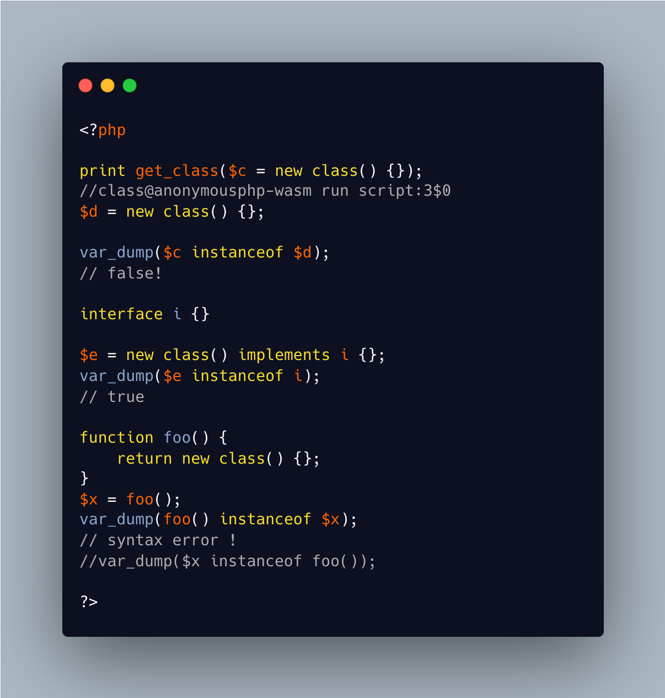

.. _every-anonymous-class-is-different:

Every Anonymous Class Is Different
----------------------------------

.. meta::
	:description:
		Every Anonymous Class Is Different: Anonymous classes don't have an explicit name, yet PHP uses one internally.
	:twitter:card: summary_large_image
	:twitter:site: @exakat
	:twitter:title: Every Anonymous Class Is Different
	:twitter:description: Every Anonymous Class Is Different: Anonymous classes don't have an explicit name, yet PHP uses one internally
	:twitter:creator: @exakat
	:twitter:image:src: https://php-tips.readthedocs.io/en/latest/_images/every_anonymous_class.png
	:og:image: https://php-tips.readthedocs.io/en/latest/_images/every_anonymous_class.png
	:og:title: Every Anonymous Class Is Different
	:og:type: article
	:og:description: Anonymous classes don't have an explicit name, yet PHP uses one internally
	:og:url: https://php-tips.readthedocs.io/en/latest/tips/every_anonymous_class.html
	:og:locale: en

.. raw:: html

	

Anonymous classes don't have an explicit name, yet PHP uses one internally. That name is build on top of the localisation of the class definition in the code.

This means that two anonymous class objects (sic), created with the same code, but at different places in the code, are considered of a different type by PHP.

On the other hand, when the same piece of code produces the anonymous class object, it is considered of the same class.

Note that the syntax ``foo() instanceof $x`` is valid, but ``$x instanceof foo()`` is not. The second operand of ``instanceof`` is a bit precious, and forbid many expressions: this is the case of a simple assignation.

See Also
________

* `Anonymous and different <https://3v4l.org/C93Ug>`_ [Try me]

PHP Features
____________

* `instanceof <https://php-dictionary.readthedocs.io/en/latest/dictionary/instanceof.ini.html>`_

* `anonymous <https://php-dictionary.readthedocs.io/en/latest/dictionary/anonymous.ini.html>`_

* `explicit <https://php-dictionary.readthedocs.io/en/latest/dictionary/explicit.ini.html>`_

* `name <https://php-dictionary.readthedocs.io/en/latest/dictionary/name.ini.html>`_

* `php <https://php-dictionary.readthedocs.io/en/latest/dictionary/php.ini.html>`_

* `class <https://php-dictionary.readthedocs.io/en/latest/dictionary/class.ini.html>`_

* `definition <https://php-dictionary.readthedocs.io/en/latest/dictionary/definition.ini.html>`_

* `anonymous-class <https://php-dictionary.readthedocs.io/en/latest/dictionary/anonymous-class.ini.html>`_

* `object <https://php-dictionary.readthedocs.io/en/latest/dictionary/object.ini.html>`_

* `type <https://php-dictionary.readthedocs.io/en/latest/dictionary/type.ini.html>`_

* `syntax <https://php-dictionary.readthedocs.io/en/latest/dictionary/syntax.ini.html>`_

* `not <https://php-dictionary.readthedocs.io/en/latest/dictionary/not.ini.html>`_

* `operand <https://php-dictionary.readthedocs.io/en/latest/dictionary/operand.ini.html>`_

* `expression <https://php-dictionary.readthedocs.io/en/latest/dictionary/expression.ini.html>`_

* `case <https://php-dictionary.readthedocs.io/en/latest/dictionary/case.ini.html>`_

* `assignation <https://php-dictionary.readthedocs.io/en/latest/dictionary/assignation.ini.html>`_

