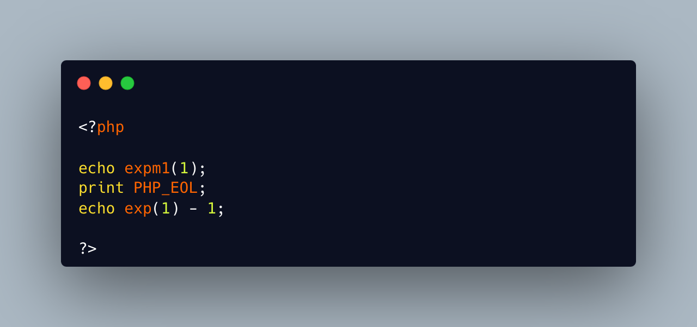

.. _exponential-minus-one:

Exponential Minus One
---------------------

.. meta::
	:description:
		Exponential Minus One: You can save typing by using expm1($x) instead of exp($x) - 1.
	:twitter:card: summary_large_image
	:twitter:site: @exakat
	:twitter:title: Exponential Minus One
	:twitter:description: Exponential Minus One: You can save typing by using expm1($x) instead of exp($x) - 1
	:twitter:creator: @exakat
	:twitter:image:src: https://php-tips.readthedocs.io/en/latest/_images/exp_minus_one.png.png
	:og:image: https://php-tips.readthedocs.io/en/latest/_images/exp_minus_one.png
	:og:title: Exponential Minus One
	:og:type: article
	:og:description: You can save typing by using expm1($x) instead of exp($x) - 1
	:og:url: https://php-tips.readthedocs.io/en/latest/tips/exp_minus_one.html
	:og:locale: en

You can save typing by using expm1($x) instead of exp($x) - 1. Also, you might have to take care of differences, as both results might be slightly different depending on the OS you're running it on : Debian is OK, but MacOS says it's different.

* `expm1() (PHP manual) <https://www.php.net/expm1>`_
* `expm1() versus exp() - 1 <https://3v4l.org/s2Y5G>`_

