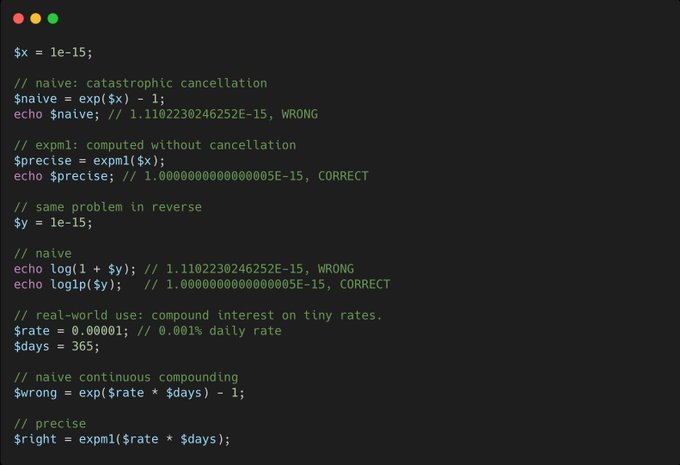

.. _expm1()-and-log1p():

expm1() And log1p()
-------------------

.. meta::
	:description:
		expm1() And log1p(): In PHP, expm1() computes exp(x) - 1.
	:twitter:card: summary_large_image
	:twitter:site: @exakat
	:twitter:title: expm1() And log1p()
	:twitter:description: expm1() And log1p(): In PHP, expm1() computes exp(x) - 1
	:twitter:creator: @exakat
	:twitter:image:src: https://php-tips.readthedocs.io/en/latest/_images/expm1.png
	:og:image: https://php-tips.readthedocs.io/en/latest/_images/expm1.png
	:og:title: expm1() And log1p()
	:og:type: article
	:og:description: In PHP, expm1() computes exp(x) - 1
	:og:url: https://php-tips.readthedocs.io/en/latest/tips/expm1.html
	:og:locale: en

.. raw:: html

	

By `Alexandre Daubois <https://x.com/alexdaubois>`_

In PHP, expm1() computes exp(x) - 1.

log1p() computes log(1 + x).

"Why not just write exp($x) - 1" you may ask...

Because when x is close to 0, floating point eats your precision alive. Think about it if you deal with finance!

These two functions exist solely to save your math from IEEE 754.

See Also
________

* `expm1 (PHP manual) <https://www.php.net/manual/en/function.expm1.php>`_
* `log1p (PHP manual) <https://www.php.net/manual/en/function.log1p.php>`_
* `exp (PHP manual) <https://www.php.net/manual/en/function.exp.php>`_
* `log (PHP manual) <https://www.php.net/manual/en/function.log.php>`_
* `IEEE 754 <https://en.wikipedia.org/wiki/IEEE_754>`_
* `expm1() And log1p() In A boat <https://3v4l.org/dm1Bh>`_ [Try me]

PHP Features
____________

* `exponential <https://php-dictionary.readthedocs.io/en/latest/dictionary/exponential.ini.html>`_

* `logarithm <https://php-dictionary.readthedocs.io/en/latest/dictionary/logarithm.ini.html>`_

