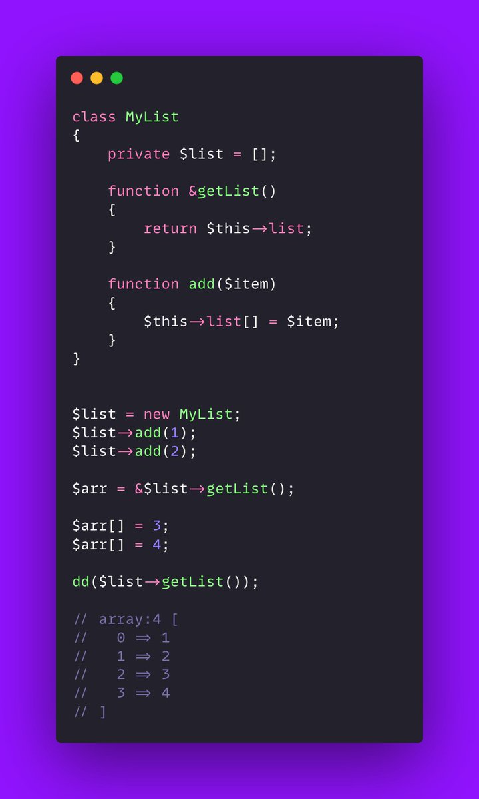

.. _exporting-properties:

Exporting Properties
--------------------

.. meta::
	:description:
		Exporting Properties: With an accessor and a reference, it is possible to export a private property and manipulate it from the outside of the object.
	:twitter:card: summary_large_image
	:twitter:site: @exakat
	:twitter:title: Exporting Properties
	:twitter:description: Exporting Properties: With an accessor and a reference, it is possible to export a private property and manipulate it from the outside of the object
	:twitter:creator: @exakat
	:twitter:image:src: https://php-tips.readthedocs.io/en/latest/_images/export_properties.png
	:og:image: https://php-tips.readthedocs.io/en/latest/_images/export_properties.png
	:og:title: Exporting Properties
	:og:type: article
	:og:description: With an accessor and a reference, it is possible to export a private property and manipulate it from the outside of the object
	:og:url: https://php-tips.readthedocs.io/en/latest/tips/export_properties.html
	:og:locale: en

.. raw:: html

	

By `Tim Macdonald <https://twitter.com/timacdonald87>`_

With an accessor and a reference, it is possible to export a private property and manipulate it from the outside of the object.

This is not recommended, as it exposes data that is supposed to be protected by its visibility.

See Also
________

* `Original Tweet) <https://twitter.com/timacdonald87/status/1615886928943153153>`_

