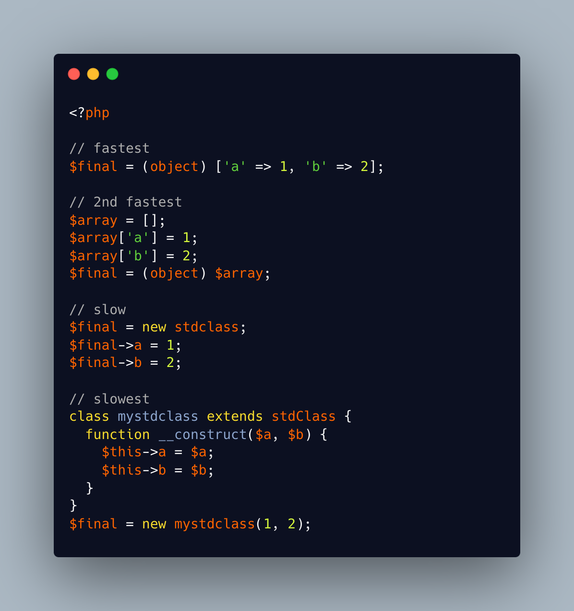

.. _fast-creation-of-stdclass-objects:

Fast Creation Of stdClass Objects
---------------------------------

.. meta::
	:description:
		Fast Creation Of stdClass Objects: The fastest way to create a ``stdClass`` object is to create an array, and then cast it to stdClass with the ``(array)`` cast operator.
	:twitter:card: summary_large_image
	:twitter:site: @exakat
	:twitter:title: Fast Creation Of stdClass Objects
	:twitter:description: Fast Creation Of stdClass Objects: The fastest way to create a ``stdClass`` object is to create an array, and then cast it to stdClass with the ``(array)`` cast operator
	:twitter:creator: @exakat
	:twitter:image:src: https://php-tips.readthedocs.io/en/latest/_images/fastest_stdclass_creation.png
	:og:image: https://php-tips.readthedocs.io/en/latest/_images/fastest_stdclass_creation.png
	:og:title: Fast Creation Of stdClass Objects
	:og:type: article
	:og:description: The fastest way to create a ``stdClass`` object is to create an array, and then cast it to stdClass with the ``(array)`` cast operator
	:og:url: https://php-tips.readthedocs.io/en/latest/tips/fastest_stdclass_creation.html
	:og:locale: en

.. raw:: html

	

The fastest way to create a ``stdClass`` object is to create an array, and then cast it to stdClass with the ``(array)`` cast operator. It is still faster even if the array is build peacemal (2 times slower).

Setting directly properties on the stdClass object is then about 3 times slower, and creating a class extension with an adapted __construc method is then 4 times slower.

In the end, this is a micro optimisation.

See Also
________

* `Converting to an object (PHP manual) <https://www.php.net/manual/en/language.types.object.php#language.types.object.casting>`_
* `4 ways to create a stdClass object <https://3v4l.org/8n1Uh>`_ [Try me]

