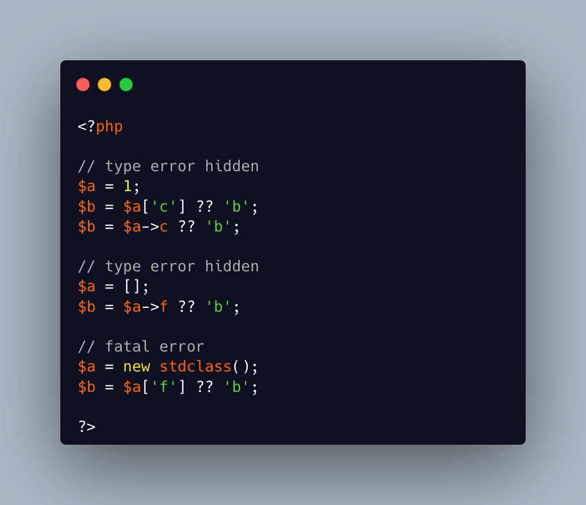

.. _coalesce-and-the-fatal-error:

Coalesce And The Fatal Error
----------------------------

.. meta::
	:description:
		Coalesce And The Fatal Error: The coalesce operator is based on the ``isset()`` feature of PHP.
	:twitter:card: summary_large_image
	:twitter:site: @exakat
	:twitter:title: Coalesce And The Fatal Error
	:twitter:description: Coalesce And The Fatal Error: The coalesce operator is based on the ``isset()`` feature of PHP
	:twitter:creator: @exakat
	:twitter:image:src: https://php-tips.readthedocs.io/en/latest/_images/fatal_error_on_coalesce.png
	:og:image: https://php-tips.readthedocs.io/en/latest/_images/fatal_error_on_coalesce.png
	:og:title: Coalesce And The Fatal Error
	:og:type: article
	:og:description: The coalesce operator is based on the ``isset()`` feature of PHP
	:og:url: https://php-tips.readthedocs.io/en/latest/tips/fatal_error_on_coalesce.html
	:og:locale: en

.. raw:: html

	

The coalesce operator is based on the ``isset()`` feature of PHP. As such, it is prone to the same issues. This is the case with a sneaky fatal error.

Usually, coalesce hide any existence check on the left operand: that way, the default value may be used without a noisy warning. This does not apply when trying to check an array index on an object: it actually yields a fatal error.

Such situation is usually rare, as the structure of the variable is usually known to some extend. On the other hand, using ``??`` on the result of an unstructure dataset, such as from a ``JSON`` or ``YAML`` (or else), it becomes far more hazardous.

Note that ``json_decode()`` has an option to generate an object or an array. In such situation, it is safer to generate an array, which does not yield fatal errors. It might also be faster to run.

See Also
________

* `isset() And The Fatal Error <https://php-tips.readthedocs.io/en/latest/tips/isset_and_the_fatal_error.html>`_
* `json_decode (PHP manual) <https://www.php.net/manual/en/function.json-decode.php>`_
* `Fatal error on coalesce <https://3v4l.org/piqCB>`_ [Try me]

PHP Error Messages
__________________

* `Cannot use object of type stdClass as array <https://php-errors.readthedocs.io/en/latest/messages/cannot-use-object-of-type-%25s-as-array.html>`_

PHP Features
____________

* `array <https://php-dictionary.readthedocs.io/en/latest/dictionary/array.ini.html>`_

* `isset <https://php-dictionary.readthedocs.io/en/latest/dictionary/isset.ini.html>`_

* `json_decode <https://php-dictionary.readthedocs.io/en/latest/dictionary/json_decode.ini.html>`_

* `object <https://php-dictionary.readthedocs.io/en/latest/dictionary/object.ini.html>`_

