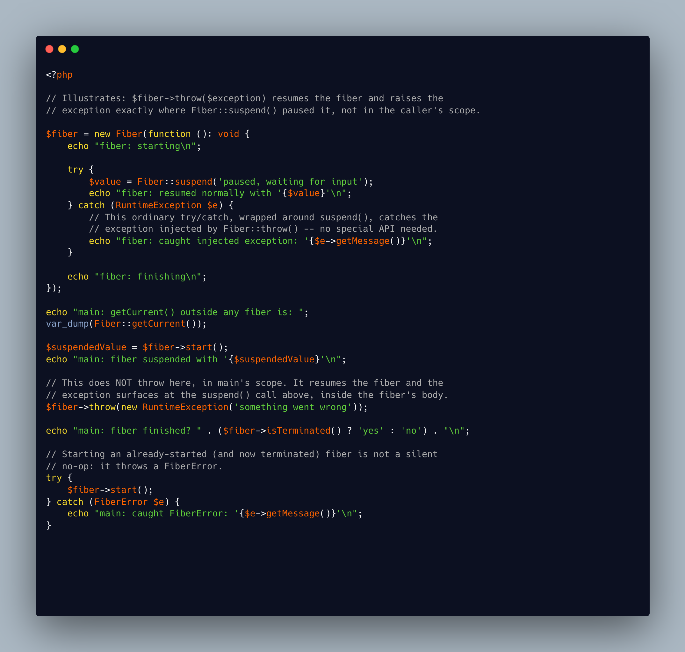

.. _fiber-throws-where-the-fiber-is:

Fiber Throws Where The Fiber Is
-------------------------------

.. meta::
	:description:
		Fiber Throws Where The Fiber Is: ``Fiber`` is the generator's sibling that nobody writes tips about, so here is one.
	:twitter:card: summary_large_image
	:twitter:site: @exakat
	:twitter:title: Fiber Throws Where The Fiber Is
	:twitter:description: Fiber Throws Where The Fiber Is: ``Fiber`` is the generator's sibling that nobody writes tips about, so here is one
	:twitter:creator: @exakat
	:twitter:image:src: https://php-tips.readthedocs.io/en/latest/_images/fiber-throw-suspension.png
	:og:image: https://php-tips.readthedocs.io/en/latest/_images/fiber-throw-suspension.png
	:og:title: Fiber Throws Where The Fiber Is
	:og:type: article
	:og:description: ``Fiber`` is the generator's sibling that nobody writes tips about, so here is one
	:og:url: https://php-tips.readthedocs.io/en/latest/tips/fiber-throw-suspension.html
	:og:locale: en

.. raw:: html

	

``Fiber`` is the generator's sibling that nobody writes tips about, so here is one.

``$fiber->throw($exception)`` does not throw in the caller's own scope. It resumes the suspended fiber and raises the exception exactly at the ``Fiber::suspend()`` call that paused it, as if that call itself had thrown.

That means an ordinary ``try``/``catch`` written around the ``suspend()`` call inside the fiber's body will catch it, with no special API needed on the fiber's side.

Also note that ``Fiber::getCurrent()`` returns ``null`` outside of any fiber, and that starting an already-started fiber throws a ``FiberError``, not a silent no-op.

See Also
________

* `Fiber (PHP manual) <https://www.php.net/manual/en/class.fiber.php>`_
* `Fiber::throw (PHP manual) <https://www.php.net/manual/en/fiber.throw.php>`_
* `Throwing from fibers <https://3v4l.org/tLEP5#v8.5.7>`_ [Try me]

PHP Features
____________

* `fibers <https://php-dictionary.readthedocs.io/en/latest/dictionary/fibers.ini.html>`_

* `generator <https://php-dictionary.readthedocs.io/en/latest/dictionary/generator.ini.html>`_

* `exception <https://php-dictionary.readthedocs.io/en/latest/dictionary/exception.ini.html>`_

