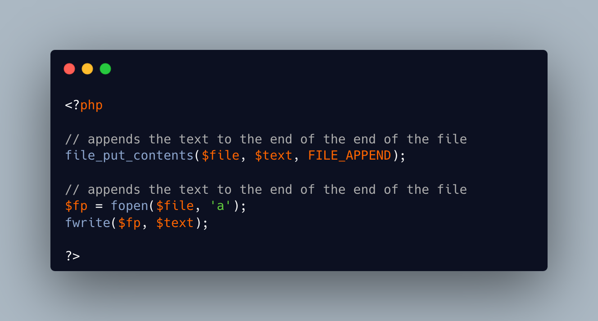

.. _a-function-called-file_append_contents():

A Function Called file_append_contents()
----------------------------------------

.. meta::
	:description:
		A Function Called file_append_contents(): file_put_contents() can append data to the end of the file, with the ``FILE_APPEND`` option.
	:twitter:card: summary_large_image
	:twitter:site: @exakat
	:twitter:title: A Function Called file_append_contents()
	:twitter:description: A Function Called file_append_contents(): file_put_contents() can append data to the end of the file, with the ``FILE_APPEND`` option
	:twitter:creator: @exakat
	:twitter:image:src: https://php-tips.readthedocs.io/en/latest/_images/file_append_contents.png
	:og:image: https://php-tips.readthedocs.io/en/latest/_images/file_append_contents.png
	:og:title: A Function Called file_append_contents()
	:og:type: article
	:og:description: file_put_contents() can append data to the end of the file, with the ``FILE_APPEND`` option
	:og:url: https://php-tips.readthedocs.io/en/latest/tips/file_append_contents.html
	:og:locale: en

.. raw:: html

	

file_put_contents() can append data to the end of the file, with the ``FILE_APPEND`` option.

file_put_contents() keeps the file opened as little as possible, and the operation is atomic. It is better then overwriting the whole file; and it is often better than fopen(), which keeps the file open until the end of the execution.

See Also
________

* `file_put_contents() <https://www.php.net/manual/en/function.file-put-contents.php>`_
* `fopen() <https://www.php.net/manual/en/function.fopen.php>`_
* `Two ways to append to files <https://3v4l.org/Da3Op>`_ [Try me]

PHP Features
____________

* `append <https://php-dictionary.readthedocs.io/en/latest/dictionary/append.ini.html>`_

* `file <https://php-dictionary.readthedocs.io/en/latest/dictionary/file.ini.html>`_

