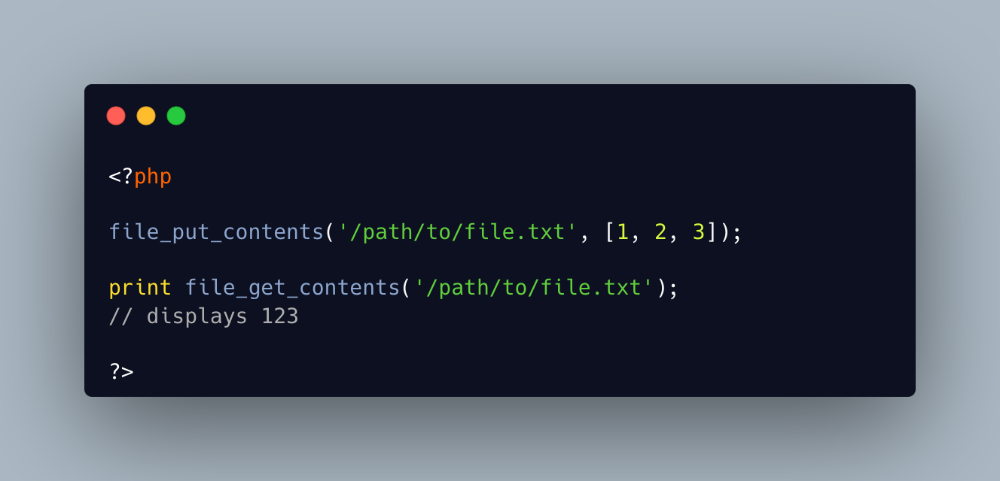

.. _file_put_contents()-with-array-argument:

file_put_contents() With Array Argument
---------------------------------------

.. meta::
	:description:
		file_put_contents() With Array Argument: The second argument of file_put_contents() is typed as ``mixed``.
	:twitter:card: summary_large_image
	:twitter:site: @exakat
	:twitter:title: file_put_contents() With Array Argument
	:twitter:description: file_put_contents() With Array Argument: The second argument of file_put_contents() is typed as ``mixed``
	:twitter:creator: @exakat
	:twitter:image:src: https://php-tips.readthedocs.io/en/latest/_images/file_put_array.png.png
	:og:image: https://php-tips.readthedocs.io/en/latest/_images/file_put_array.png
	:og:title: file_put_contents() With Array Argument
	:og:type: article
	:og:description: The second argument of file_put_contents() is typed as ``mixed``
	:og:url: https://php-tips.readthedocs.io/en/latest/tips/file_put_array.html
	:og:locale: en

By `Gina Peter Banyard <https://github.com/Girgias>`_

The second argument of file_put_contents() is typed as ``mixed``. It may be a string, which is the most common case. It may be a stream, (aka, a resource), which pours a file into a file.

It also may be an array. PHP simply writes the elements of the array in the file, like an ``implode('', $array)``.

* `file_put_contents (PHP manual) <https://www.php.net/manual/en/function.file-put-contents.php>`_

