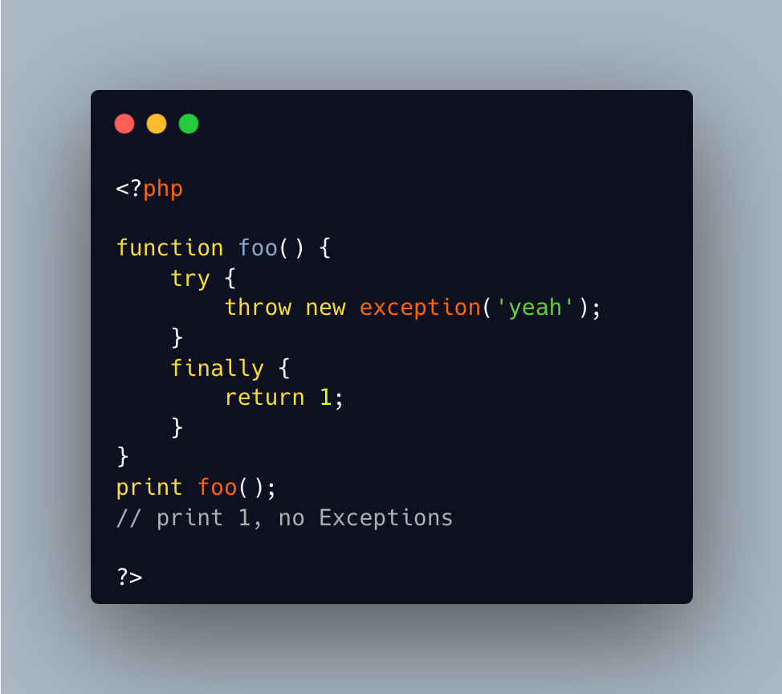

.. _finally-catches-exception:

Finally Catches Exception
-------------------------

.. meta::
	:description:
		Finally Catches Exception: In this code, finally is executed after the throw.
	:twitter:card: summary_large_image
	:twitter:site: @exakat
	:twitter:title: Finally Catches Exception
	:twitter:description: Finally Catches Exception: In this code, finally is executed after the throw
	:twitter:creator: @exakat
	:twitter:image:src: https://php-tips.readthedocs.io/en/latest/_images/finally_catches_exception.png
	:og:image: https://php-tips.readthedocs.io/en/latest/_images/finally_catches_exception.png
	:og:title: Finally Catches Exception
	:og:type: article
	:og:description: In this code, finally is executed after the throw
	:og:url: https://php-tips.readthedocs.io/en/latest/tips/finally_catches_exception.html
	:og:locale: en

.. raw:: html

	

In this code, finally is executed after the throw. Since it contains a return, the function is finalized before the throw is executed. The exception is then lost, and the scripts displays 1. This is why it is recommended to avoid return in a finally clause.

See Also
________

* `Finally (PHP manual) <https://www.php.net/manual/en/language.exceptions.php#language.exceptions.finally>`_
* `Catch an exception with finally <https://3v4l.org/uVRJ3>`_ [Try me]

PHP Features
____________

* `finally <https://php-dictionary.readthedocs.io/en/latest/dictionary/finally.ini.html>`_

* `return <https://php-dictionary.readthedocs.io/en/latest/dictionary/return.ini.html>`_

