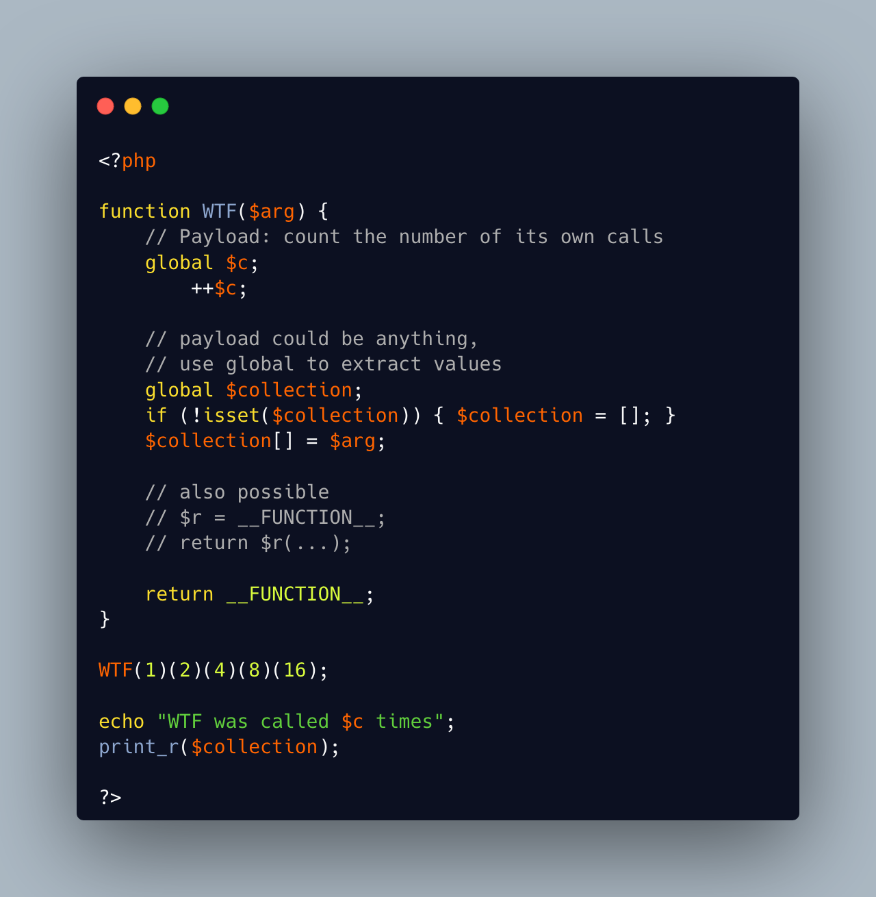

.. _fluent-function:

Fluent Function
---------------

.. meta::
	:description:
		Fluent Function: A fluent interface allows the chaining of method calls.
	:twitter:card: summary_large_image
	:twitter:site: @exakat
	:twitter:title: Fluent Function
	:twitter:description: Fluent Function: A fluent interface allows the chaining of method calls
	:twitter:creator: @exakat
	:twitter:image:src: https://php-tips.readthedocs.io/en/latest/_images/fluent_function.png
	:og:image: https://php-tips.readthedocs.io/en/latest/_images/fluent_function.png
	:og:title: Fluent Function
	:og:type: article
	:og:description: A fluent interface allows the chaining of method calls
	:og:url: https://php-tips.readthedocs.io/en/latest/tips/fluent_function.html
	:og:locale: en

.. raw:: html

	

A fluent interface allows the chaining of method calls. It is a bit harder to do with functions, as there is no supporting object, but it is possible.

Returning ``__FUNCTION__`` allows the subsequent call of the same function.

Returning a closure of itself is also possible, yet a bit more cumbersome, as ``__FUNCTION__`` is not recognized as a string for a function call.

Thanks to Andreas Heigl for the inspiration.

See Also
________

* `Magic Constant (PHP manual) <https://www.php.net/manual/en/language.constants.magic.php>`_
* `First Class Callable (PHP manual) <https://www.php.net/manual/en/functions.first_class_callable_syntax.php>`_
* `Fluent Functions <https://3v4l.org/HAPDR>`_ [Try me]

