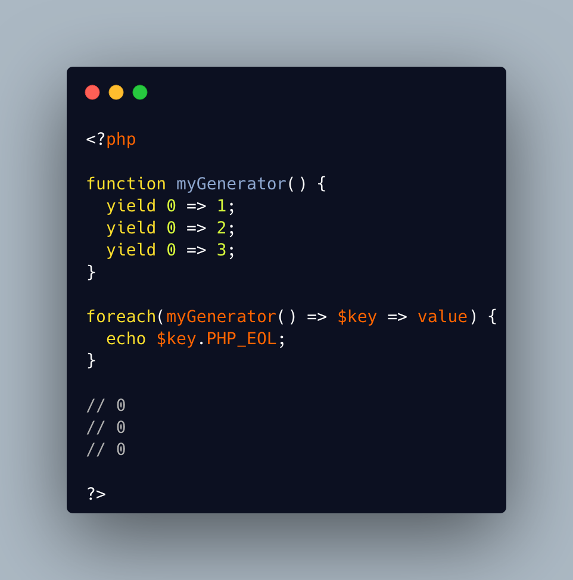

.. _foreach()-with-all-the-same-keys:

foreach() With All The Same Keys
--------------------------------

.. meta::
	:description:
		foreach() With All The Same Keys: It is possible for a foreach() loop to produce multiple times the same key.

It is possible for a foreach() loop to produce multiple times the same key. To do so, avoid using arrays, which enforce the unique key.

One need to use a generator or a Traversable class, where the same key is always yielded.

* `foreach (PHP manual) <https://www.php.net/manual/en/control-structures.foreach.php>`_
* `yield (PHP manual) <https://www.php.net/manual/en/language.generators.syntax.php>`_

