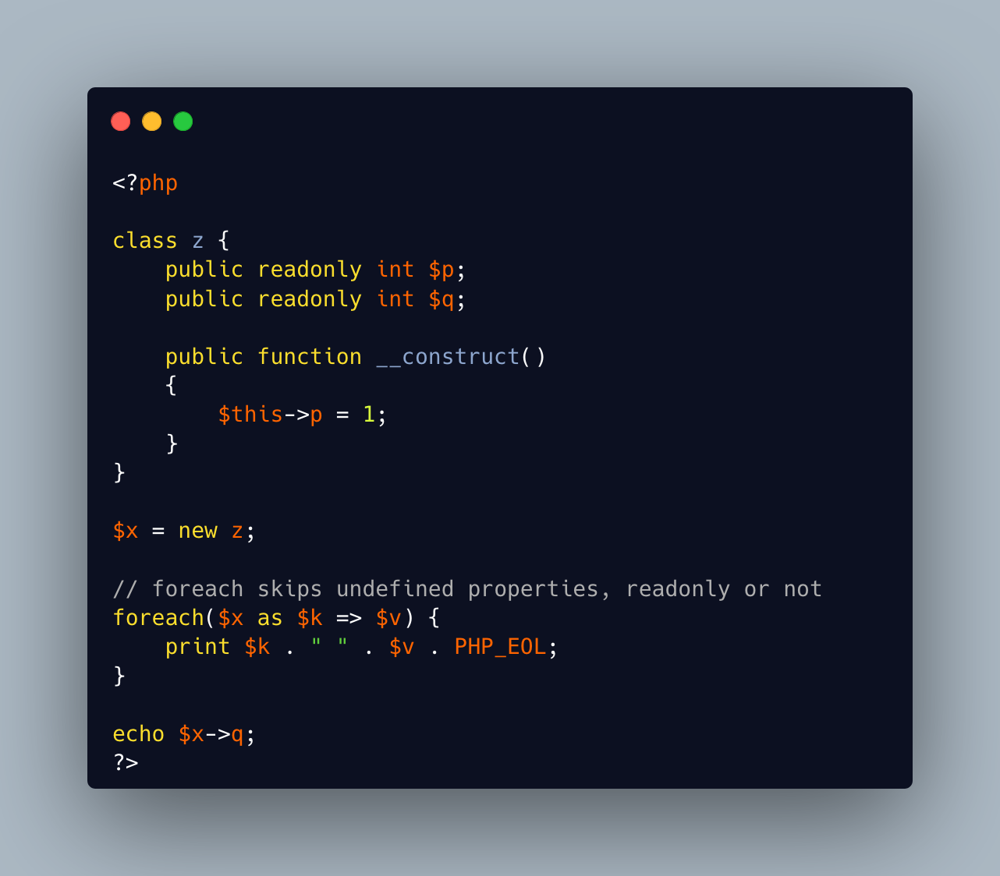

.. _foreach()-skips-uninitialized-properties:

Foreach() Skips Uninitialized Properties
----------------------------------------

.. meta::
	:description:
		Foreach() Skips Uninitialized Properties: Foreach() reads naturally all public properties in an object.
	:twitter:card: summary_large_image
	:twitter:site: @exakat
	:twitter:title: Foreach() Skips Uninitialized Properties
	:twitter:description: Foreach() Skips Uninitialized Properties: Foreach() reads naturally all public properties in an object
	:twitter:creator: @exakat
	:twitter:image:src: https://php-tips.readthedocs.io/en/latest/_images/foreach_skips_uninitialized.png
	:og:image: https://php-tips.readthedocs.io/en/latest/_images/foreach_skips_uninitialized.png
	:og:title: Foreach() Skips Uninitialized Properties
	:og:type: article
	:og:description: Foreach() reads naturally all public properties in an object
	:og:url: https://php-tips.readthedocs.io/en/latest/tips/foreach_skips_uninitialized.html
	:og:locale: en

Foreach() reads naturally all public properties in an object. Protected and private are omitted, unless in the right context.

Foreach() also skips silently uninitialized properties: this prevents the generation of NULL values, but also, skips all readonly properties: any direct hit on such property would otherwise generate a Fatal error.

* `Foreach (PHP manual) <https://www.php.net/manual/en/control-structures.foreach.php#control-structures.foreach>`_

