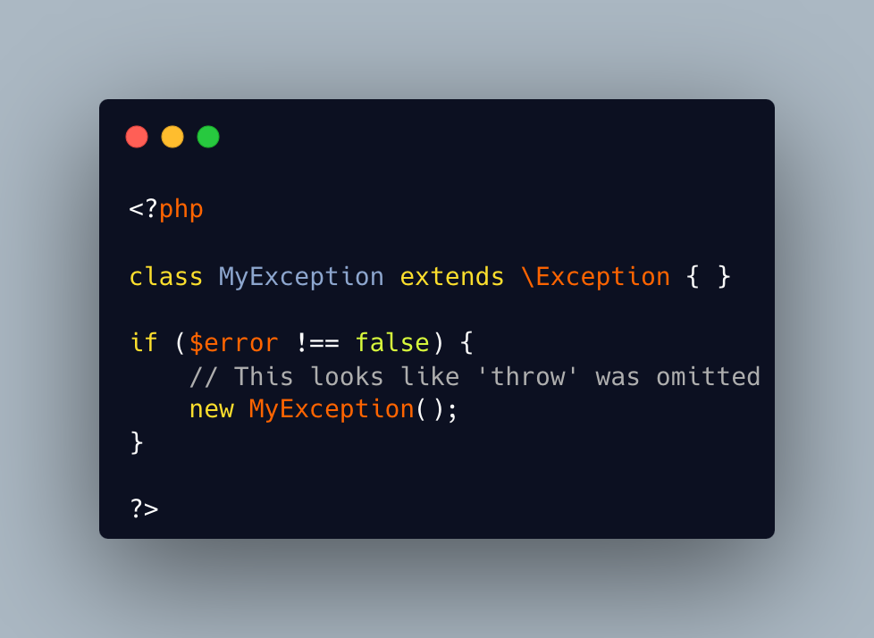

.. _forgotten-throw:

Forgotten Throw
---------------

.. meta::
	:description:
		Forgotten Throw: Sometimes, the ``throw`` keyword is forgotten, even as it is needed.
	:twitter:card: summary_large_image
	:twitter:site: @exakat
	:twitter:title: Forgotten Throw
	:twitter:description: Forgotten Throw: Sometimes, the ``throw`` keyword is forgotten, even as it is needed
	:twitter:creator: @exakat
	:twitter:image:src: https://php-tips.readthedocs.io/en/latest/_images/forgotten_throw.png
	:og:image: https://php-tips.readthedocs.io/en/latest/_images/forgotten_throw.png
	:og:title: Forgotten Throw
	:og:type: article
	:og:description: Sometimes, the ``throw`` keyword is forgotten, even as it is needed
	:og:url: https://php-tips.readthedocs.io/en/latest/tips/forgotten_throw.html
	:og:locale: en

.. raw:: html

	

Sometimes, the ``throw`` keyword is forgotten, even as it is needed. It is difficult to realize it is missing: PHP instantiates correctly the exception, yet it immediately ignores it, as there is no usage of that exception: no error is reported. One need to identify a situation with an error, understand that the error is missing.

See Also
________

* `Exceptions (PHP manual) <https://www.php.net/manual/en/language.exceptions.php>`_
* `Forgetting something? <https://3v4l.org/tMv3J>`_ [Try me]

PHP Features
____________

* `throw <https://php-dictionary.readthedocs.io/en/latest/dictionary/throw.ini.html>`_

