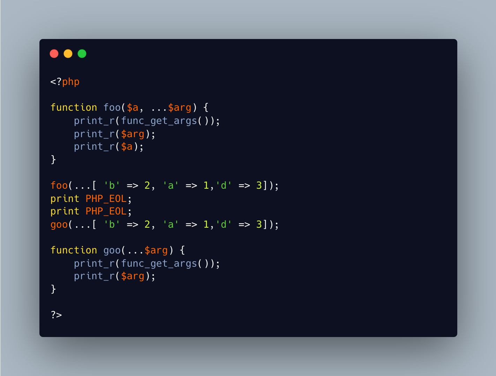

.. _func_get_args()-skips-variadic:

func_get_args() Skips Variadic
------------------------------

.. meta::
	:description:
		func_get_args() Skips Variadic: func_get_args() does not provide the variadic argument, when there is one.
	:twitter:card: summary_large_image
	:twitter:site: @exakat
	:twitter:title: func_get_args() Skips Variadic
	:twitter:description: func_get_args() Skips Variadic: func_get_args() does not provide the variadic argument, when there is one
	:twitter:creator: @exakat
	:twitter:image:src: https://php-tips.readthedocs.io/en/latest/_images/func_get_args.png
	:og:image: https://php-tips.readthedocs.io/en/latest/_images/func_get_args.png
	:og:title: func_get_args() Skips Variadic
	:og:type: article
	:og:description: func_get_args() does not provide the variadic argument, when there is one
	:og:url: https://php-tips.readthedocs.io/en/latest/tips/func_get_args.html
	:og:locale: en

.. raw:: html

	

func_get_args() does not provide the variadic argument, when there is one. It is simply omitted.

func_get_args() lists only the declared parameters, with their position, rather than their name.

func_get_args() is the traditional way to hand arbitrary number of arguments, and with this difference of behavior related to variadic, it provides a different set of features.

Nowadays, 23% of PHP applications use this feature.

See Also
________

* `func_get_args() (PHP manual) <https://www.php.net/manual/en/function.func-get-args.php>`_
* `func_get_args() versus variadic <https://3v4l.org/2U6E4>`_ [Try me]

PHP Features
____________

* `variadic <https://php-dictionary.readthedocs.io/en/latest/dictionary/variadic.ini.html>`_

* `arbitrary-argument <https://php-dictionary.readthedocs.io/en/latest/dictionary/arbitrary-argument.ini.html>`_

