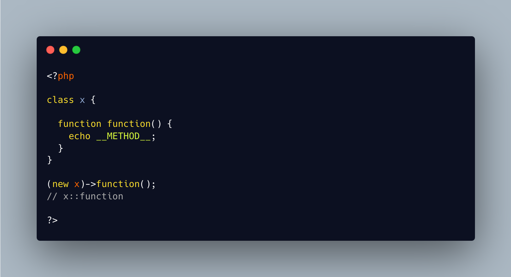

.. _the-function-method:

The Function Method
-------------------

.. meta::
	:description:
		The Function Method: It is possible to name a method 'function'.
	:twitter:card: summary_large_image.
	:twitter:site: @exakat.
	:twitter:title: The Function Method.
	:twitter:description: The Function Method: It is possible to name a method 'function'.
	:twitter:creator: @exakat.
	:twitter:image:src: https://php-tips.readthedocs.io/en/latest/_images/function_function.png.png.
	:og:image: https://php-tips.readthedocs.io/en/latest/_images/function_function.png.png.
	:og:image: The Function Method: It is possible to name a method 'function'.

By `Brent Roose <https://twitter.com/brendt_gd>`_

It is possible to name a method 'function'. This is part of the relaxed keywords of PHP, which allows PHP keywords to be used as a method name.

Of course, it is also possible to create a function called method.

