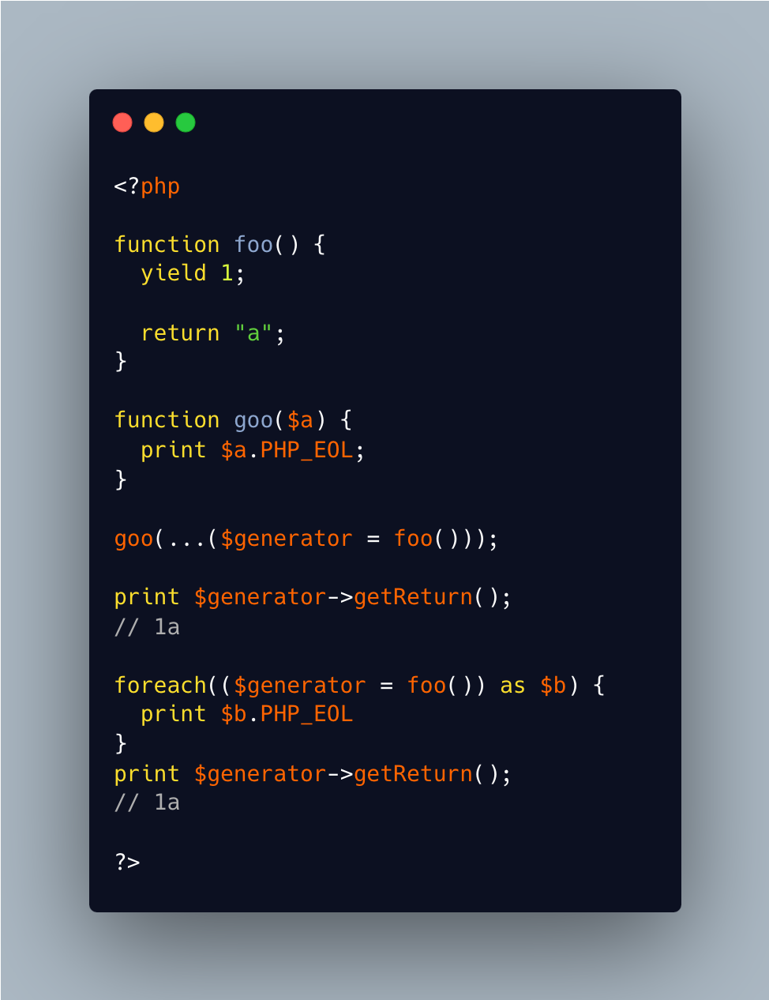

.. _get-the-generator:

Get The Generator
-----------------

.. meta::
	:description:
		Get The Generator: It is possible to catch a generator when it is called, by putting it in a variable.
	:twitter:card: summary_large_image
	:twitter:site: @exakat
	:twitter:title: Get The Generator
	:twitter:description: Get The Generator: It is possible to catch a generator when it is called, by putting it in a variable
	:twitter:creator: @exakat
	:twitter:image:src: https://php-tips.readthedocs.io/en/latest/_images/get_the_generator.png
	:og:image: https://php-tips.readthedocs.io/en/latest/_images/get_the_generator.png
	:og:title: Get The Generator
	:og:type: article
	:og:description: It is possible to catch a generator when it is called, by putting it in a variable
	:og:url: https://php-tips.readthedocs.io/en/latest/tips/get_the_generator.html
	:og:locale: en

.. raw:: html

	

It is possible to catch a generator when it is called, by putting it in a variable. Once the generator has been used, it is possible to call a method such as ``getReturn`` on it.

This works with ``...`` and ``foreach``.

See Also
________

* `Generators overview (PHP manual) <https://www.php.net/manual/en/language.generators.overview.php>`_

