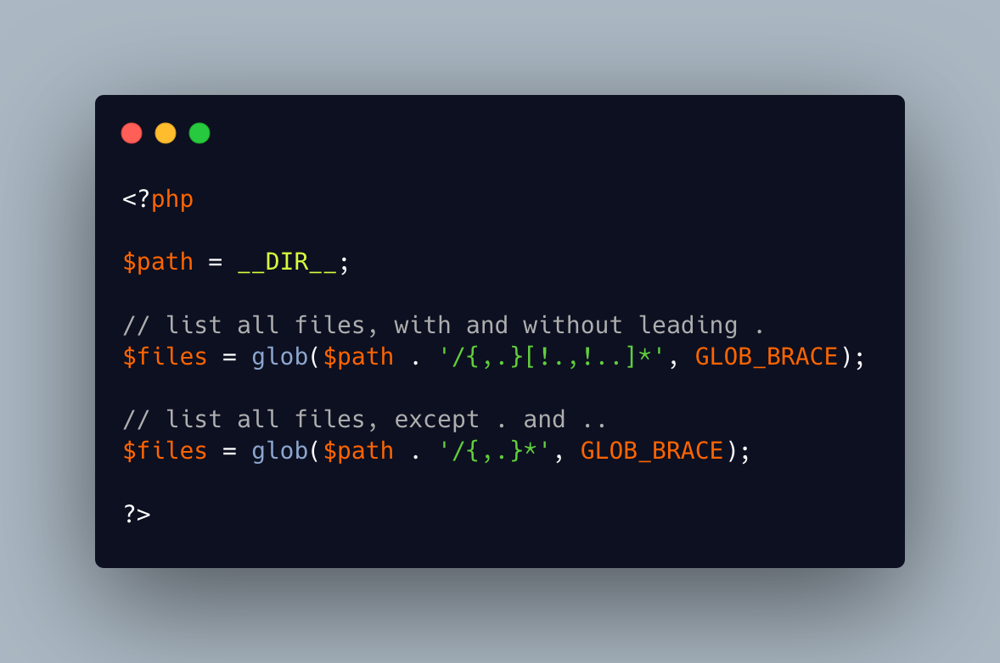

.. _glob()-with-hidden-files:

glob() With Hidden Files
------------------------

	.. meta::
		:description lang=en:
			glob() With Hidden Files: By default, the glob() function list only files that don't start with a dot.

By default, the glob() function list only files that don't start with a dot. With the GLOB_BRACE option, it is possible to list all files, and even filter out the evergreen '.' and '..'. 

* `glob <https://www.php.net/manual/en/function.glob.php>`_

