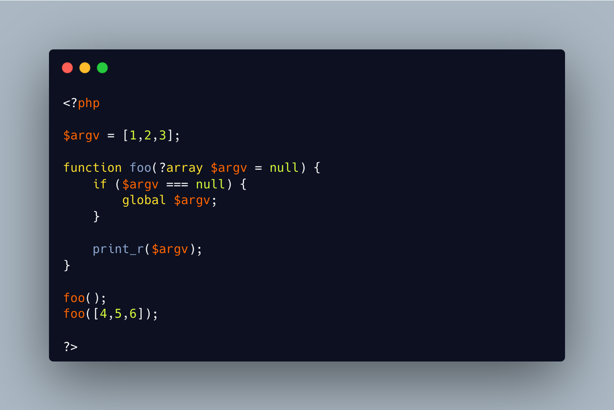

.. _global-overwrites:

global Overwrites
-----------------

.. meta::
	:description:
		global Overwrites: The ``global`` keyword is actually enough to overwrite a local variable.
	:twitter:card: summary_large_image
	:twitter:site: @exakat
	:twitter:title: global Overwrites
	:twitter:description: global Overwrites: The ``global`` keyword is actually enough to overwrite a local variable
	:twitter:creator: @exakat
	:twitter:image:src: https://php-tips.readthedocs.io/en/latest/_images/global_overwrite.png
	:og:image: https://php-tips.readthedocs.io/en/latest/_images/global_overwrite.png
	:og:title: global Overwrites
	:og:type: article
	:og:description: The ``global`` keyword is actually enough to overwrite a local variable
	:og:url: https://php-tips.readthedocs.io/en/latest/tips/global_overwrite.html
	:og:locale: en

.. raw:: html

	

The ``global`` keyword is actually enough to overwrite a local variable.

In this illustration, the default value is used to trigger fetching the global variable ``$argv``. The instruction is alone in the block, but it actually replaces the current variable, aka the parameter, by the global one. No assignation in sight, merely a surprise.

This won't work with superglobal, such as ``$_POST``, which can't be overwritten by a parameter.

See Also
________

* `global Overwrites <https://3v4l.org/UBSoD>`_ [Try me]

PHP Error Messages
__________________

* `Cannot re-assign auto-global variable %s <https://php-errors.readthedocs.io/en/latest/messages/cannot-use-auto-global-as-lexical-variable.html>`_

PHP Features
____________

* `global <https://php-dictionary.readthedocs.io/en/latest/dictionary/global.ini.html>`_

* `default <https://php-dictionary.readthedocs.io/en/latest/dictionary/default.ini.html>`_

* `$argv <https://php-dictionary.readthedocs.io/en/latest/dictionary/%24argv.ini.html>`_

