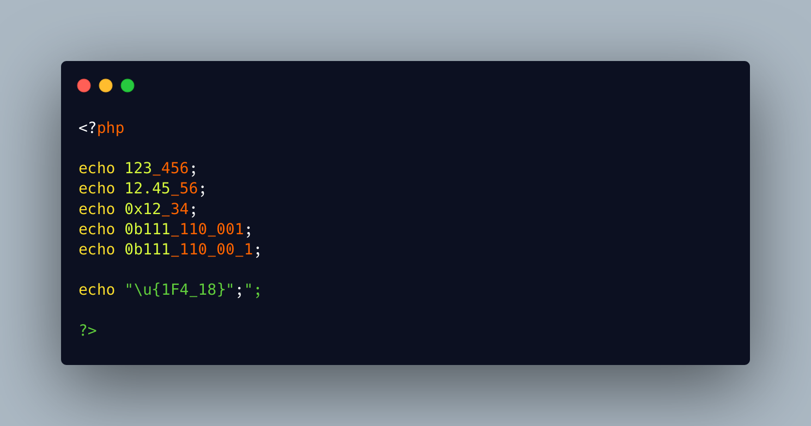

.. _hexadecimal-separator:

Hexadecimal Separator
---------------------

.. meta::
	:description:
		Hexadecimal Separator: PHP offers a number separator since PHP 8.
	:twitter:card: summary_large_image
	:twitter:site: @exakat
	:twitter:title: Hexadecimal Separator
	:twitter:description: Hexadecimal Separator: PHP offers a number separator since PHP 8
	:twitter:creator: @exakat
	:twitter:image:src: https://php-tips.readthedocs.io/en/latest/_images/hexadecimal_separator.png
	:og:image: https://php-tips.readthedocs.io/en/latest/_images/hexadecimal_separator.png
	:og:title: Hexadecimal Separator
	:og:type: article
	:og:description: PHP offers a number separator since PHP 8
	:og:url: https://php-tips.readthedocs.io/en/latest/tips/hexadecimal_separator.html
	:og:locale: en

.. raw:: html

	

PHP offers a number separator since PHP 8.0: ``_``. It may be added inside any integer or float, to make long list of digits more readable.

In fact, this also applies to the other integer notations: hexadecimal, octal, binary, etc. Just don't put it inside the header, like ``0_x_1``, but in the body of the integer.

Interestingly, the separator does not work in string sequences, like inside an hexadecimal unicode representation.

See Also
________

* `Hexadecimal separated <https://3v4l.org/AQRE2>`_ [Try me]

PHP Error Messages
__________________

* `Invalid UTF-8 codepoint escape <https://php-errors.readthedocs.io/en/latest/messages/invalid-utf-8-codepoint-escape.html>`_

PHP Features
____________

* `numeric-separator <https://php-dictionary.readthedocs.io/en/latest/dictionary/numeric-separator.ini.html>`_

* `underscore <https://php-dictionary.readthedocs.io/en/latest/dictionary/underscore.ini.html>`_

* `hexadecimal-integer <https://php-dictionary.readthedocs.io/en/latest/dictionary/hexadecimal-integer.ini.html>`_

* `octal-integer <https://php-dictionary.readthedocs.io/en/latest/dictionary/octal-integer.ini.html>`_

* `binary-integer <https://php-dictionary.readthedocs.io/en/latest/dictionary/binary-integer.ini.html>`_

* `unicode <https://php-dictionary.readthedocs.io/en/latest/dictionary/unicode.ini.html>`_

* `escape-sequence <https://php-dictionary.readthedocs.io/en/latest/dictionary/escape-sequence.ini.html>`_

