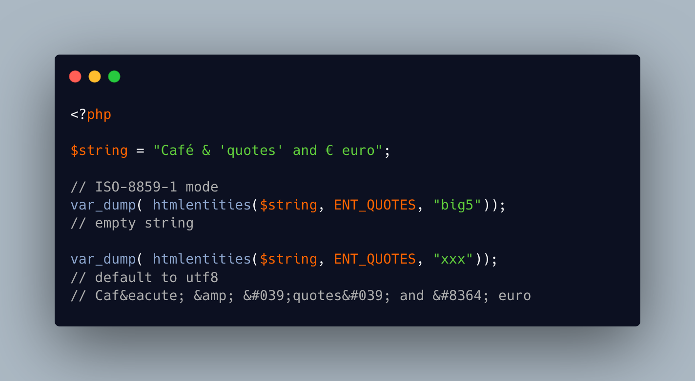

.. _when-htmlemtities()-is-failing:

When htmlemtities() Is Failing
------------------------------

.. meta::
	:description:
		When htmlemtities() Is Failing: By default, htmlemtities() uses UTF-8.
	:twitter:card: summary_large_image
	:twitter:site: @exakat
	:twitter:title: When htmlemtities() Is Failing
	:twitter:description: When htmlemtities() Is Failing: By default, htmlemtities() uses UTF-8
	:twitter:creator: @exakat
	:twitter:image:src: https://php-tips.readthedocs.io/en/latest/_images/htmlemtities_failing.png
	:og:image: https://php-tips.readthedocs.io/en/latest/_images/htmlemtities_failing.png
	:og:title: When htmlemtities() Is Failing
	:og:type: article
	:og:description: By default, htmlemtities() uses UTF-8
	:og:url: https://php-tips.readthedocs.io/en/latest/tips/htmlemtities_failing.html
	:og:locale: en

.. raw:: html

	

By default, htmlemtities() uses UTF-8. The third argument of that function is the actual encoding, so it is parametrable. When using a non-existing encoding, such as ``xxx``, PHP detects it, and default to UTF8 (here it works well).

On the other hand, when using a valid encoding, but that is not supported, PHP default to returning an empty string.

See Also
________

* `utf8, big5 and xxx <https://3v4l.org/1vaRr#veol>`_ [Try me]

PHP Error Messages
__________________

* `Only basic entities substitution is supported for multi-byte encodings other than UTF-8; functionality is equivalent to htmlspecialchars <https://php-errors.readthedocs.io/en/latest/messages/only-basic-entities-substitution-is-supported-for-multi-byte-encodings-other-than-utf-8%3B-functionality-is-equivalent-to-htmlspecialchars.html>`_

PHP Features
____________

* `htmlentities <https://php-dictionary.readthedocs.io/en/latest/dictionary/htmlentities.ini.html>`_

* `encoding <https://php-dictionary.readthedocs.io/en/latest/dictionary/encoding.ini.html>`_

