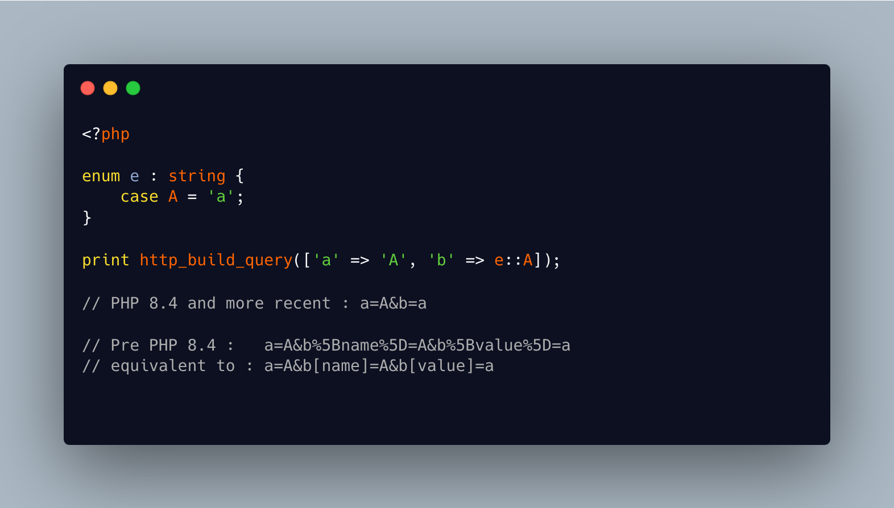

.. _http_build_query()-and-enumerations:

http_build_query() And Enumerations
-----------------------------------

.. meta::
	:description:
		http_build_query() And Enumerations: When using a backed enum with http_build_query(), the PHP native function uses the value of the case, and not the case itself.
	:twitter:card: summary_large_image
	:twitter:site: @exakat
	:twitter:title: http_build_query() And Enumerations
	:twitter:description: http_build_query() And Enumerations: When using a backed enum with http_build_query(), the PHP native function uses the value of the case, and not the case itself
	:twitter:creator: @exakat
	:twitter:image:src: https://php-tips.readthedocs.io/en/latest/_images/http_build_query_enum.png
	:og:image: https://php-tips.readthedocs.io/en/latest/_images/http_build_query_enum.png
	:og:title: http_build_query() And Enumerations
	:og:type: article
	:og:description: When using a backed enum with http_build_query(), the PHP native function uses the value of the case, and not the case itself
	:og:url: https://php-tips.readthedocs.io/en/latest/tips/http_build_query_enum.html
	:og:locale: en

.. raw:: html

	

When using a backed enum with http_build_query(), the PHP native function uses the value of the case, and not the case itself. This is very convenient to output a compatible value, instead of an internal object. This is valid since PHP 8.4.

See Also
________

* `http_build_query and enum <https://3v4l.org/0mWQs>`_ [Try me]

