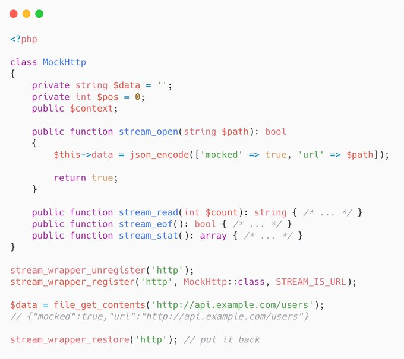

.. _replacing-php-http-wrapper:

Replacing PHP http Wrapper
--------------------------

.. meta::
	:description:
		Replacing PHP http Wrapper: Did you know you can override built-in protocols such as https://.
	:twitter:card: summary_large_image
	:twitter:site: @exakat
	:twitter:title: Replacing PHP http Wrapper
	:twitter:description: Replacing PHP http Wrapper: Did you know you can override built-in protocols such as https://
	:twitter:creator: @exakat
	:twitter:image:src: https://php-tips.readthedocs.io/en/latest/_images/http_wrapper.png
	:og:image: https://php-tips.readthedocs.io/en/latest/_images/http_wrapper.png
	:og:title: Replacing PHP http Wrapper
	:og:type: article
	:og:description: Did you know you can override built-in protocols such as https://
	:og:url: https://php-tips.readthedocs.io/en/latest/tips/http_wrapper.html
	:og:locale: en

.. raw:: html

	

By `Alexandre Daubois <https://x.com/alexdaubois>`_

Did you know you can override built-in protocols such as https://?

You can create mocks! I'd advise to use dedicated tools such as #Symfony MockHttpClient. But in the case of vanilla PHP...

I'll let you tell me if it's a good or a terrible idea 😉.

See Also
________

* `original tweet <https://x.com/alexdaubois/status/2026210142677598565>`_
* `http wrapper renewed <https://3v4l.org/RH2uq#veol>`_ [Try me]

PHP Features
____________

* `wrapper <https://php-dictionary.readthedocs.io/en/latest/dictionary/wrapper.ini.html>`_

* `php-wrapper <https://php-dictionary.readthedocs.io/en/latest/dictionary/php-wrapper.ini.html>`_

