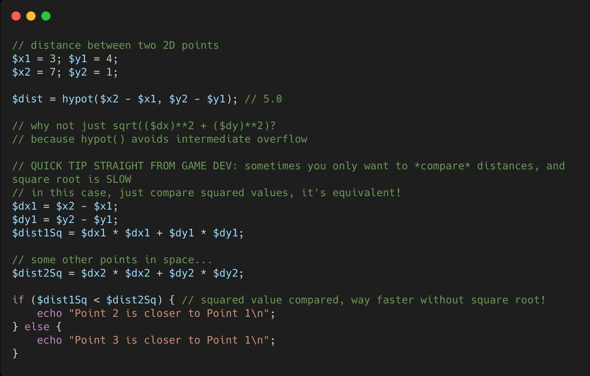

.. _hypothenus-in-action:

Hypothenus In Action
--------------------

.. meta::
	:description:
		Hypothenus In Action: PHP has a built-in Euclidean distance function, if you need to calculate a distance!.
	:twitter:card: summary_large_image
	:twitter:site: @exakat
	:twitter:title: Hypothenus In Action
	:twitter:description: Hypothenus In Action: PHP has a built-in Euclidean distance function, if you need to calculate a distance!
	:twitter:creator: @exakat
	:twitter:image:src: https://php-tips.readthedocs.io/en/latest/_images/hypot.png
	:og:image: https://php-tips.readthedocs.io/en/latest/_images/hypot.png
	:og:title: Hypothenus In Action
	:og:type: article
	:og:description: PHP has a built-in Euclidean distance function, if you need to calculate a distance!
	:og:url: https://php-tips.readthedocs.io/en/latest/tips/hypot.html
	:og:locale: en

.. raw:: html

	

By `Alexandre Daubois <https://x.com/alexdaubois>`_

PHP has a built-in Euclidean distance function, if you need to calculate a distance!

Sounds complex, but it's just the hypothenuse! Without the overflow risk of doing it manually.

If you ONLY need to *compare* distances, don't miss the tip at the end of the code snippet!

See Also
________

* `hypot (PHP manual) <https://www.php.net/manual/en/function.hypot.php>`_
* `Original Tweet <https://x.com/alexdaubois/status/2035990120688476239>`_
* `hypot in action <https://3v4l.org/Aacol#veol>`_ [Try me]

PHP Features
____________

* `hypot <https://php-dictionary.readthedocs.io/en/latest/dictionary/hypot.ini.html>`_

* `math <https://php-dictionary.readthedocs.io/en/latest/dictionary/math.ini.html>`_

* `sqrt <https://php-dictionary.readthedocs.io/en/latest/dictionary/sqrt.ini.html>`_

