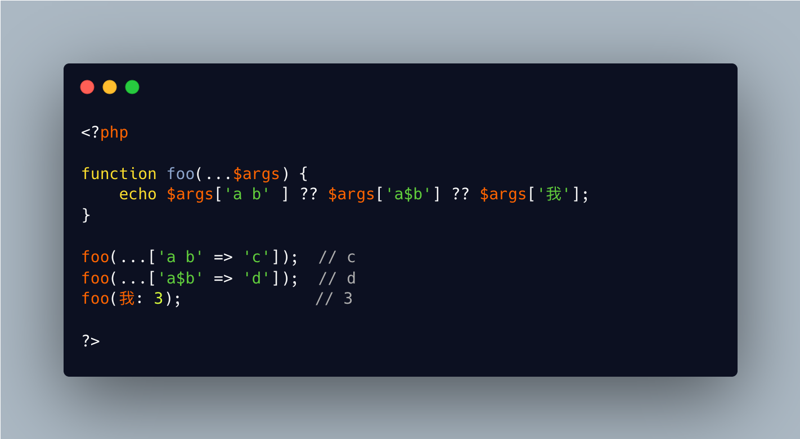

.. _impossible-named-arguments:

Impossible Named Arguments
--------------------------

.. meta::
	:description:
		Impossible Named Arguments: Named parameters use the parameter name to allocate the argument.
	:twitter:card: summary_large_image
	:twitter:site: @exakat
	:twitter:title: Impossible Named Arguments
	:twitter:description: Impossible Named Arguments: Named parameters use the parameter name to allocate the argument
	:twitter:creator: @exakat
	:twitter:image:src: https://php-tips.readthedocs.io/en/latest/_images/impossible_named_arguments.png
	:og:image: https://php-tips.readthedocs.io/en/latest/_images/impossible_named_arguments.png
	:og:title: Impossible Named Arguments
	:og:type: article
	:og:description: Named parameters use the parameter name to allocate the argument
	:og:url: https://php-tips.readthedocs.io/en/latest/tips/impossible_named_arguments.html
	:og:locale: en

.. raw:: html

	

Named parameters use the parameter name to allocate the argument. This implies that the provided parameter names are all compatible with a the variable name format. For example, it is not possible to use a space or a ``$`` sign in a variable name.

On the other hand, using the spread ``...`` operator on an array turns the string keys as named parameter. Any string may be an array index, so they are transmitted to the function. There, they are not validated against the variable name format, but simply checked against the list of existing parameters.

An edge case is the variadic parameter. That parameter accepts any named parameter, even if it does not check the variable format, as these values are stored in an array 

And that's how it is possible to use impossible named parameter.

See Also
________

* `Using impossible parameter names <https://3v4l.org/U88Ip>`_

