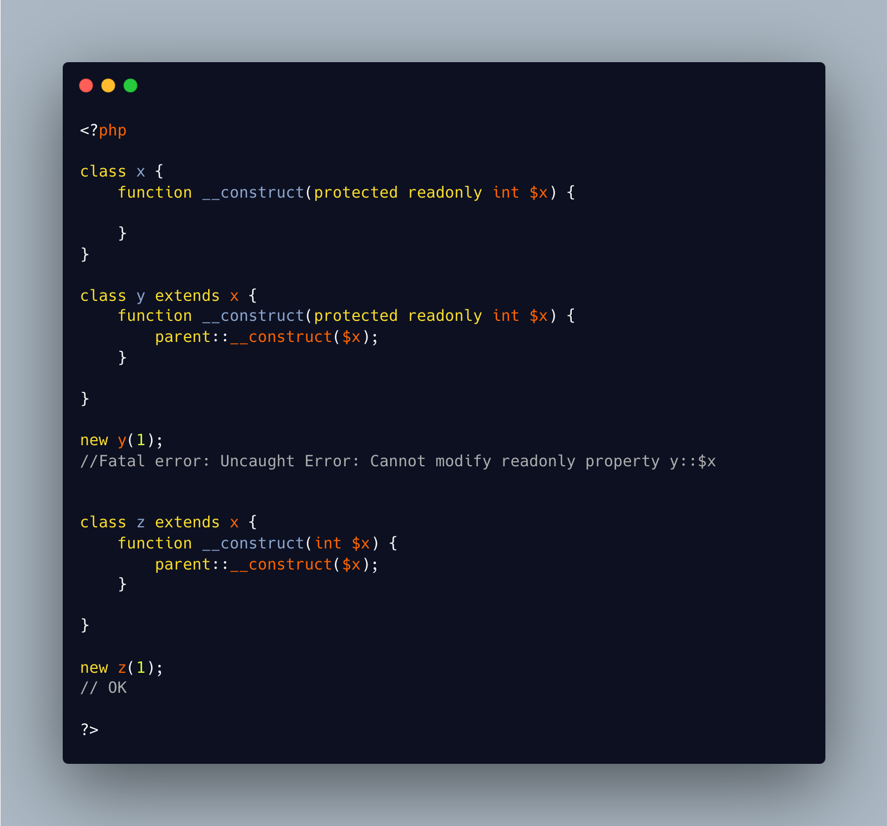

.. _incompatible-promoted-readonlies:

Incompatible Promoted Readonlies
--------------------------------

.. meta::
	:description:
		Incompatible Promoted Readonlies: Promoted properties allows the creation of properties directly from the constructor signature.
	:twitter:card: summary_large_image
	:twitter:site: @exakat
	:twitter:title: Incompatible Promoted Readonlies
	:twitter:description: Incompatible Promoted Readonlies: Promoted properties allows the creation of properties directly from the constructor signature
	:twitter:creator: @exakat
	:twitter:image:src: https://php-tips.readthedocs.io/en/latest/_images/incompatible-promoted-readonlies.png
	:og:image: https://php-tips.readthedocs.io/en/latest/_images/incompatible-promoted-readonlies.png
	:og:title: Incompatible Promoted Readonlies
	:og:type: article
	:og:description: Promoted properties allows the creation of properties directly from the constructor signature
	:og:url: https://php-tips.readthedocs.io/en/latest/tips/incompatible-promoted-readonlies.html
	:og:locale: en

Promoted properties allows the creation of properties directly from the constructor signature.

readonly properties are only written once, and cannot be written again.

When a promoted property is public or protected, it cannot be used in two constructor's signature, as the first instance is immediately written, and cannot be changed again.

This doesn't happen with private, which keeps the properties distinct in the class and its parent. This still may produce confusion.

It is then possible to only use one promoted property definition, and skip that parameter in the other constructor; or make the second a simple parameter, rather than a promoted property.

* `Constructor promotion (PHP manual) <https://www.php.net/manual/en/language.oop5.decon.php#language.oop5.decon.constructor.promotion>`_
* `Properties <https://www.php.net/manual/en/language.oop5.properties.php>`_

