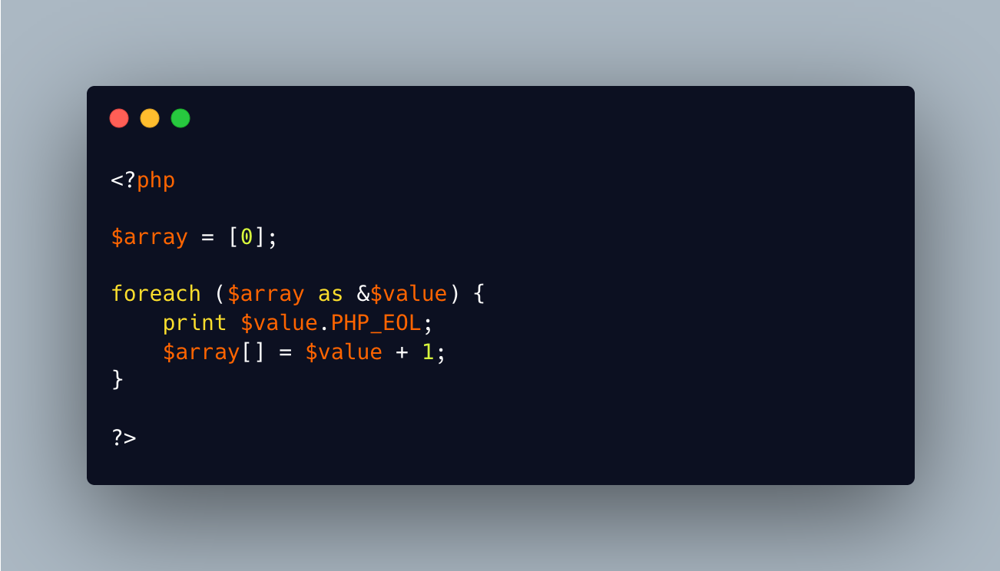

.. _infinite-foreach():

Infinite foreach()
------------------

.. meta::
	:description:
		Infinite foreach(): Foreach() is built against infinite loops: it works on a finite number of elements in arrays.
	:twitter:card: summary_large_image
	:twitter:site: @exakat
	:twitter:title: Infinite foreach()
	:twitter:description: Infinite foreach(): Foreach() is built against infinite loops: it works on a finite number of elements in arrays
	:twitter:creator: @exakat
	:twitter:image:src: https://php-tips.readthedocs.io/en/latest/_images/infinite_foreach.png
	:og:image: https://php-tips.readthedocs.io/en/latest/_images/infinite_foreach.png
	:og:title: Infinite foreach()
	:og:type: article
	:og:description: Foreach() is built against infinite loops: it works on a finite number of elements in arrays
	:og:url: https://php-tips.readthedocs.io/en/latest/tips/infinite_foreach.html
	:og:locale: en

.. raw:: html

	

Foreach() is built against infinite loops: it works on a finite number of elements in arrays. Using an infinite generator is possible, but cheating with a second infinite loop.

So, the trick is to update the source array during the loop, to keep giving new keys to PHP, that it will check. Over, and over, and over.

See Also
________

* `Foreach (PHP manual) <https://www.php.net/manual/en/control-structures.foreach.php>`_
* `Infinite loops in PHP <https://www.exakat.io/infinite-loops-in-php/>`_
* `Infinite loop with Foreach() <https://3v4l.org/EdqjS>`_ [Try me]

PHP Features
____________

* `loop <https://php-dictionary.readthedocs.io/en/latest/dictionary/loop.ini.html>`_

* `foreach <https://php-dictionary.readthedocs.io/en/latest/dictionary/foreach.ini.html>`_

