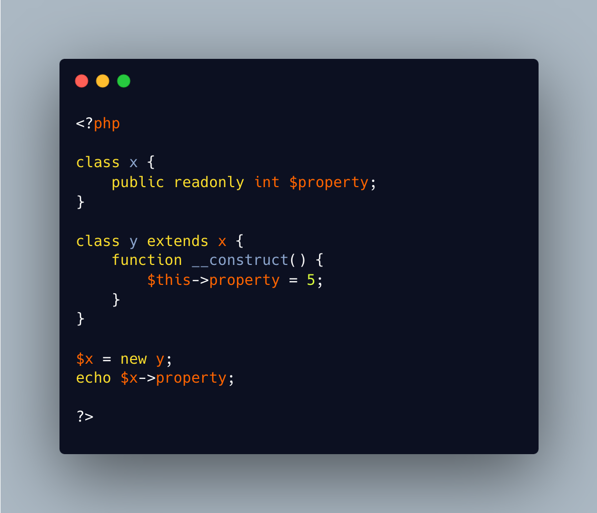

.. _initialize-readonly-on-child:

Initialize Readonly On Child
----------------------------

.. meta::
	:description:
		Initialize Readonly On Child: Readonly properties could only be initialized in the same class as their definition.
	:twitter:card: summary_large_image
	:twitter:site: @exakat
	:twitter:title: Initialize Readonly On Child
	:twitter:description: Initialize Readonly On Child: Readonly properties could only be initialized in the same class as their definition
	:twitter:creator: @exakat
	:twitter:image:src: https://php-tips.readthedocs.io/en/latest/_images/initialize_readonly_on_child.png
	:og:image: https://php-tips.readthedocs.io/en/latest/_images/initialize_readonly_on_child.png
	:og:title: Initialize Readonly On Child
	:og:type: article
	:og:description: Readonly properties could only be initialized in the same class as their definition
	:og:url: https://php-tips.readthedocs.io/en/latest/tips/initialize_readonly_on_child.html
	:og:locale: en

.. raw:: html

	

Readonly properties could only be initialized in the same class as their definition. That holds true, whatever the visibility of the property: ``private``, ``protected``, ``private``.

In PHP 8.4, it is now possible to initialize the readonly properties from a child class, if the visibility allows. And the property is assigned only once.

See Also
________

* `Initialize Readonly On Child <https://3v4l.org/WtXbB>`_ [Try me]

PHP Error Messages
__________________

* `Typed property %s::$%s must not be accessed before initialization <https://php-errors.readthedocs.io/en/latest/messages/typed-property-%25s%3A%3A%24%25s-must-not-be-accessed-before-initialization.html>`_

PHP Features
____________

* `property <https://php-dictionary.readthedocs.io/en/latest/dictionary/property.ini.html>`_

* `initialisation <https://php-dictionary.readthedocs.io/en/latest/dictionary/initialisation.ini.html>`_

* `readonly <https://php-dictionary.readthedocs.io/en/latest/dictionary/readonly.ini.html>`_

* `inheritance <https://php-dictionary.readthedocs.io/en/latest/dictionary/inheritance.ini.html>`_

