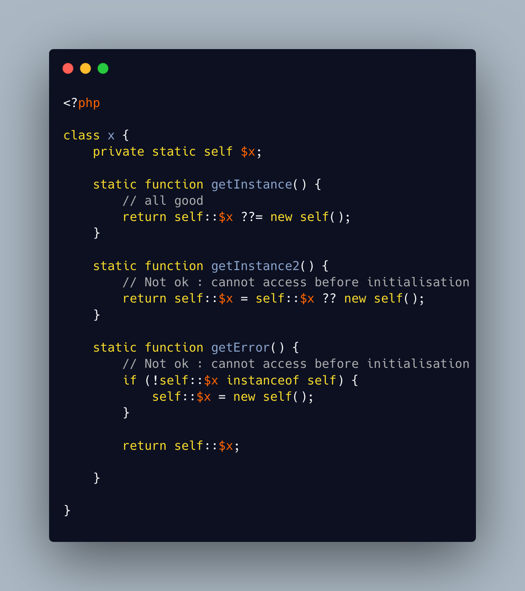

.. _only-initialize-with-short-assignation-coalesce:

Only Initialize With Short Assignation Coalesce
-----------------------------------------------

.. meta::
	:description:
		Only Initialize With Short Assignation Coalesce: It is not possible to access a property before its initialisation.
	:twitter:card: summary_large_image
	:twitter:site: @exakat
	:twitter:title: Only Initialize With Short Assignation Coalesce
	:twitter:description: Only Initialize With Short Assignation Coalesce: It is not possible to access a property before its initialisation
	:twitter:creator: @exakat
	:twitter:image:src: https://php-tips.readthedocs.io/en/latest/_images/initialize_with_coalesce.png
	:og:image: https://php-tips.readthedocs.io/en/latest/_images/initialize_with_coalesce.png
	:og:title: Only Initialize With Short Assignation Coalesce
	:og:type: article
	:og:description: It is not possible to access a property before its initialisation
	:og:url: https://php-tips.readthedocs.io/en/latest/tips/initialize_with_coalesce.html
	:og:locale: en

.. raw:: html

	

It is not possible to access a property before its initialisation. This is true to both static and normal properties.

While normal properties are initialized at constructor time, static properties might require a check before assignation : in case the property has not been yet assigned, a Fatal error will stop the code execution.

In fact, there is a way : it is the short assignation with coalesce, which will accept to check the NULL value, and only fill it if it is null.

See Also
________

* `Properties <https://www.php.net/manual/en/language.oop5.properties.php>`_
* `this function never returns <https://3v4l.org/ZmVk4>`_ [Try me]

PHP Features
____________

* `property <https://php-dictionary.readthedocs.io/en/latest/dictionary/property.ini.html>`_

* `short-assignation <https://php-dictionary.readthedocs.io/en/latest/dictionary/short-assignation.ini.html>`_

* `coalesce <https://php-dictionary.readthedocs.io/en/latest/dictionary/coalesce.ini.html>`_

