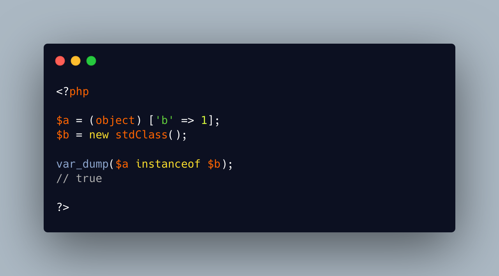

.. _instanceof-with-variables:

instanceof With Variables
-------------------------

.. meta::
	:description:
		instanceof With Variables: It is possible to compare the type of two objects with ``instanceof``: PHP uses the class of the second operand, or the name of the class passed as a string.
	:twitter:card: summary_large_image
	:twitter:site: @exakat
	:twitter:title: instanceof With Variables
	:twitter:description: instanceof With Variables: It is possible to compare the type of two objects with ``instanceof``: PHP uses the class of the second operand, or the name of the class passed as a string
	:twitter:creator: @exakat
	:twitter:image:src: https://php-tips.readthedocs.io/en/latest/_images/instanceof_with_variable.png
	:og:image: https://php-tips.readthedocs.io/en/latest/_images/instanceof_with_variable.png
	:og:title: instanceof With Variables
	:og:type: article
	:og:description: It is possible to compare the type of two objects with ``instanceof``: PHP uses the class of the second operand, or the name of the class passed as a string
	:og:url: https://php-tips.readthedocs.io/en/latest/tips/instanceof_with_variable.html
	:og:locale: en

.. raw:: html

	

It is possible to compare the type of two objects with ``instanceof``: PHP uses the class of the second operand, or the name of the class passed as a string.

Here, note that the cast operator ``(object)`` creates ``stdClass`` when applied to array.

See Also
________

* `Type operators (PHP manual) <https://www.php.net/manual/en/language.operators.type.php>`_
* `instanceof With Variables <https://3v4l.org/UCoEf>`_ [Try me]

