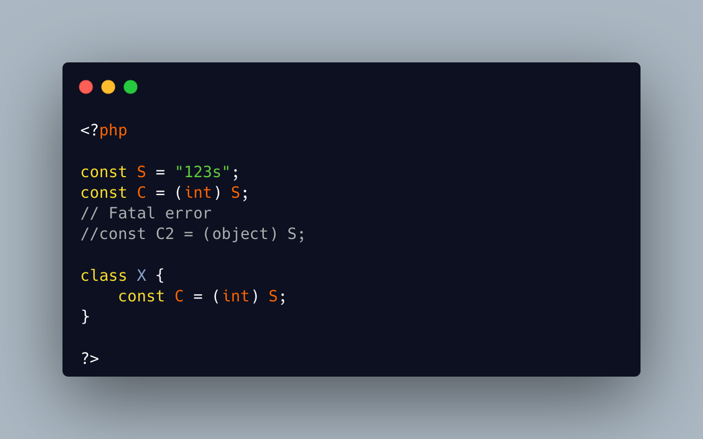

.. _(int)-and-(ant):

(int) And (ant)
---------------

.. meta::
	:description:
		(int) And (ant): It is possible to store a Closure in a constant, since PHP 8.
	:twitter:card: summary_large_image
	:twitter:site: @exakat
	:twitter:title: (int) And (ant)
	:twitter:description: (int) And (ant): It is possible to store a Closure in a constant, since PHP 8
	:twitter:creator: @exakat
	:twitter:image:src: https://php-tips.readthedocs.io/en/latest/_images/int_and_ant.png
	:og:image: https://php-tips.readthedocs.io/en/latest/_images/int_and_ant.png
	:og:title: (int) And (ant)
	:og:type: article
	:og:description: It is possible to store a Closure in a constant, since PHP 8
	:og:url: https://php-tips.readthedocs.io/en/latest/tips/int_and_ant.html
	:og:locale: en

.. raw:: html

	

It is possible to store a Closure in a constant, since PHP 8.5. This means that the closure has to be called by storing the constant in parenthesis: this way, PHP first extracts the value of the constant, then, calls the closure.

There is something else that is between parenthesis: a cast. And ``cast`` has a very high priority. So, when a ``int`` constant is created, it still calls the cast, and ignores the constant.

May be constants should not be called as casts?

See Also
________

* `Cast is so strong <https://php-tips.readthedocs.io/en/latest/tips/cast_is_strong.html>`_
* `Of int and ant <https://3v4l.org/nQXAL>`_ [Try me]

PHP Error Messages
__________________

* `Constant expression contains invalid operations <https://php-errors.readthedocs.io/en/latest/messages/constant-expression-contains-invalid-operations.html>`_

PHP Features
____________

* `cast <https://php-dictionary.readthedocs.io/en/latest/dictionary/cast.ini.html>`_

* `constant <https://php-dictionary.readthedocs.io/en/latest/dictionary/constant.ini.html>`_

