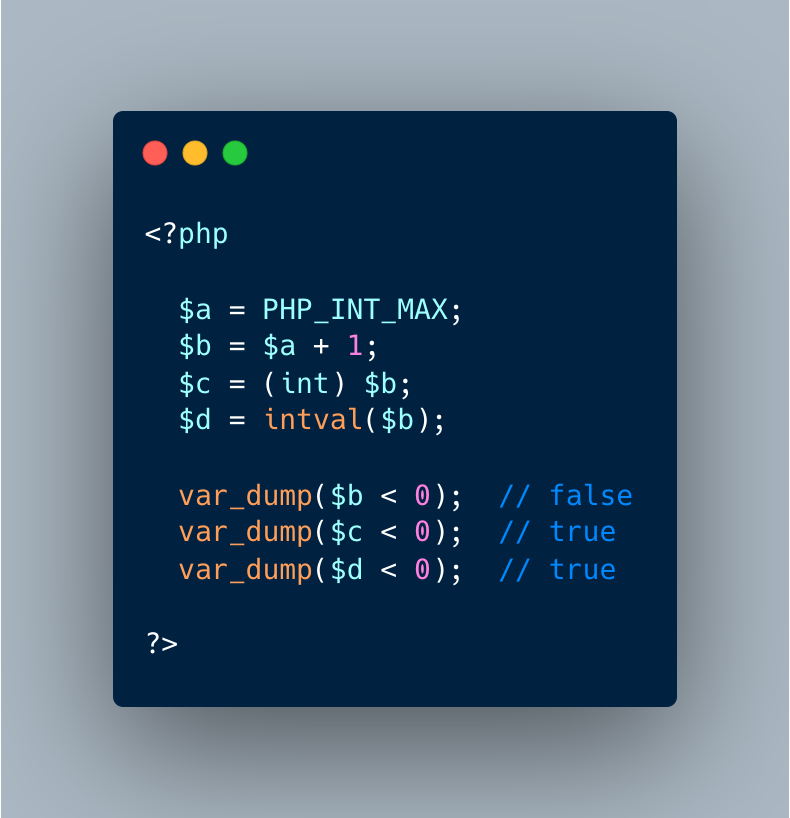

.. _integer-becomes-negative:

Integer Becomes Negative
------------------------

.. meta::
	:description:
		Integer Becomes Negative: $a is the largest integer in PHP.
	:twitter:card: summary_large_image
	:twitter:site: @exakat
	:twitter:title: Integer Becomes Negative
	:twitter:description: Integer Becomes Negative: $a is the largest integer in PHP
	:twitter:creator: @exakat
	:twitter:image:src: https://php-tips.readthedocs.io/en/latest/_images/int_back_to_negative.png
	:og:image: https://php-tips.readthedocs.io/en/latest/_images/int_back_to_negative.png
	:og:title: Integer Becomes Negative
	:og:type: article
	:og:description: $a is the largest integer in PHP
	:og:url: https://php-tips.readthedocs.io/en/latest/tips/int_back_to_negative.html
	:og:locale: en

.. raw:: html

	

$a is the largest integer in PHP. So, $b, which is one bigger than $a, is actually a float, which is bigger and still positive. When casting the float to an integer, the integer is turned into a negative number by overflowing.

See Also
________

* `Integer (PHP manual) <https://www.php.net/manual/en/language.types.integer.php>`_

