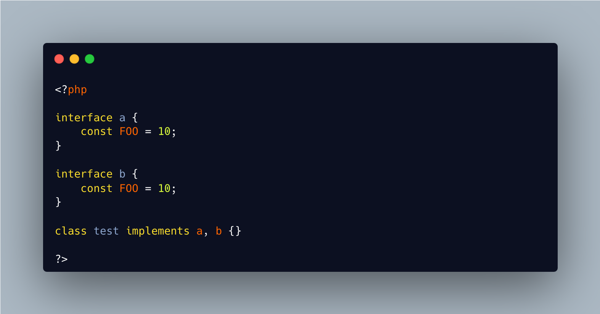

.. _interfaces-constants-conflicts:

Interfaces Constants Conflicts
------------------------------

	.. meta::
		:description lang=en:
			Interfaces Constants Conflicts: PHP reports duplicate constant definitions in different interfaces.

PHP reports duplicate constant definitions in different interfaces.

This is very unusual occurrence, reported at linting time. It may also lead to quite a set back when one has to untangle these definitions.

So, shall we always give unique names across interfaces? Or just avoid multiple interfaces with constants on the same class?

There is no 'use' expression to solve the conflict.

Also, multiple same methods in different interface are OK.

* `Object Interfaces (PHP manual) <https://www.php.net/manual/en/language.oop5.interfaces.php>`_

