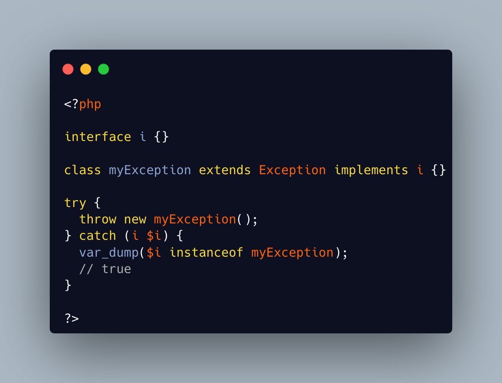

.. _exception-polyphormism:

Exception Polyphormism
----------------------

.. meta::
	:description:
		Exception Polyphormism: Custom exceptions are like any other classes: they may implements interfaces.
	:twitter:card: summary_large_image
	:twitter:site: @exakat
	:twitter:title: Exception Polyphormism
	:twitter:description: Exception Polyphormism: Custom exceptions are like any other classes: they may implements interfaces
	:twitter:creator: @exakat
	:twitter:image:src: https://php-tips.readthedocs.io/en/latest/_images/interface_exceptions.png
	:og:image: https://php-tips.readthedocs.io/en/latest/_images/interface_exceptions.png
	:og:title: Exception Polyphormism
	:og:type: article
	:og:description: Custom exceptions are like any other classes: they may implements interfaces
	:og:url: https://php-tips.readthedocs.io/en/latest/tips/interface_exceptions.html
	:og:locale: en

.. raw:: html

	

Custom exceptions are like any other classes: they may implements interfaces. Later, that interface may be used to catch the exception, even if the interface has nothing to do with exceptions. And with several interfaces on the same exception, it is possible to catch them in different ways.

See Also
________

* `Exceptions <https://www.php.net/manual/en/language.exceptions.php>`_

