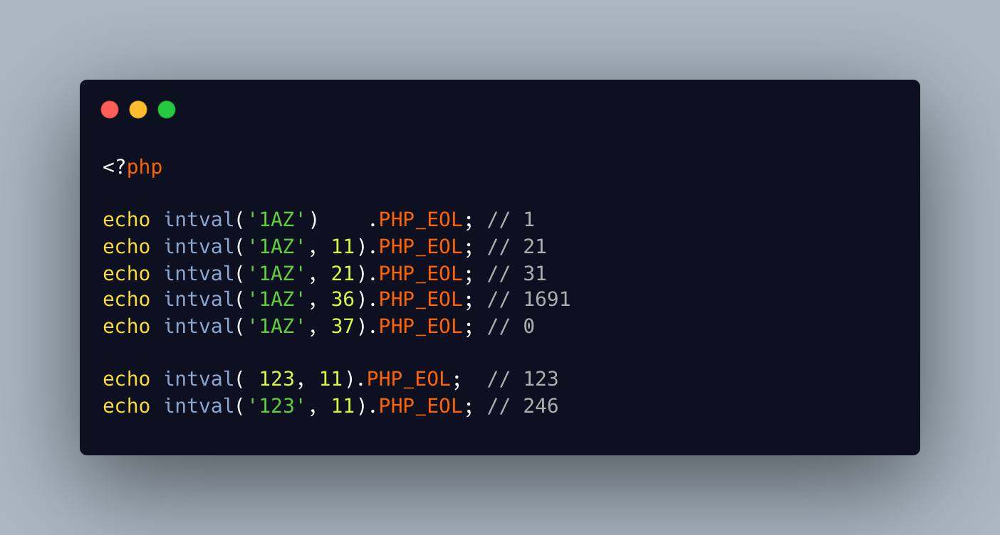

.. _intval()-and-its-arguments:

intval() And Its Arguments
--------------------------

.. meta::
	:description:
		intval() And Its Arguments: What is happening here.
	:twitter:card: summary_large_image
	:twitter:site: @exakat
	:twitter:title: intval() And Its Arguments
	:twitter:description: intval() And Its Arguments: What is happening here
	:twitter:creator: @exakat
	:twitter:image:src: https://php-tips.readthedocs.io/en/latest/_images/intval.png
	:og:image: https://php-tips.readthedocs.io/en/latest/_images/intval.png
	:og:title: intval() And Its Arguments
	:og:type: article
	:og:description: What is happening here
	:og:url: https://php-tips.readthedocs.io/en/latest/tips/intval.html
	:og:locale: en

.. raw:: html

	

What is happening here? Multiple things to unfold, actually.

The first line is a classic ``intval()`` call, which tries to convert a string (or almost anything else), into its decimal equivalent. Here, the conversion stops at ``A``, because it is not a number.

The second line is a less classic ``intval``: the second argument is the numeric base for conversion. Here, with ``11``, it means that the next number is ``A``, or ``a``. So, the result is ``10 + 1 * 11 = 21``.

The third line raise the numeric base. While ``A`` is still 10, the ``1`` is now 21, so total is ``10 + 1 * 21 = 31``. Of course, hexadecimal is supported, with the base ``16``.

We can raise the numeric base until the last letter, ``Z`` : the second argument maxes out at ``10 + 26 = 36``. There, the string is converted to ``1691``.

Beyond 36, there is no more available letters in the alphabet, so PHP just silently stops.

Finally, note that providing an integer to ``intval()`` has the same value returned as a result, whatever the numeric base. As a string, it is converted.

See Also
________

* `Intval (PHP manual) <https://www.php.net/intval>`_
* `Type Casting (PHP manual) <https://www.php.net/manual/en/language.types.type-juggling.php#language.types.typecasting>`_
* `intval() and usages <https://3v4l.org/UaCpt#veol>`_ [Try me]

PHP Features
____________

* `integer <https://php-dictionary.readthedocs.io/en/latest/dictionary/integer.ini.html>`_

* `cast <https://php-dictionary.readthedocs.io/en/latest/dictionary/cast.ini.html>`_

* `numeric-base <https://php-dictionary.readthedocs.io/en/latest/dictionary/numeric-base.ini.html>`_

