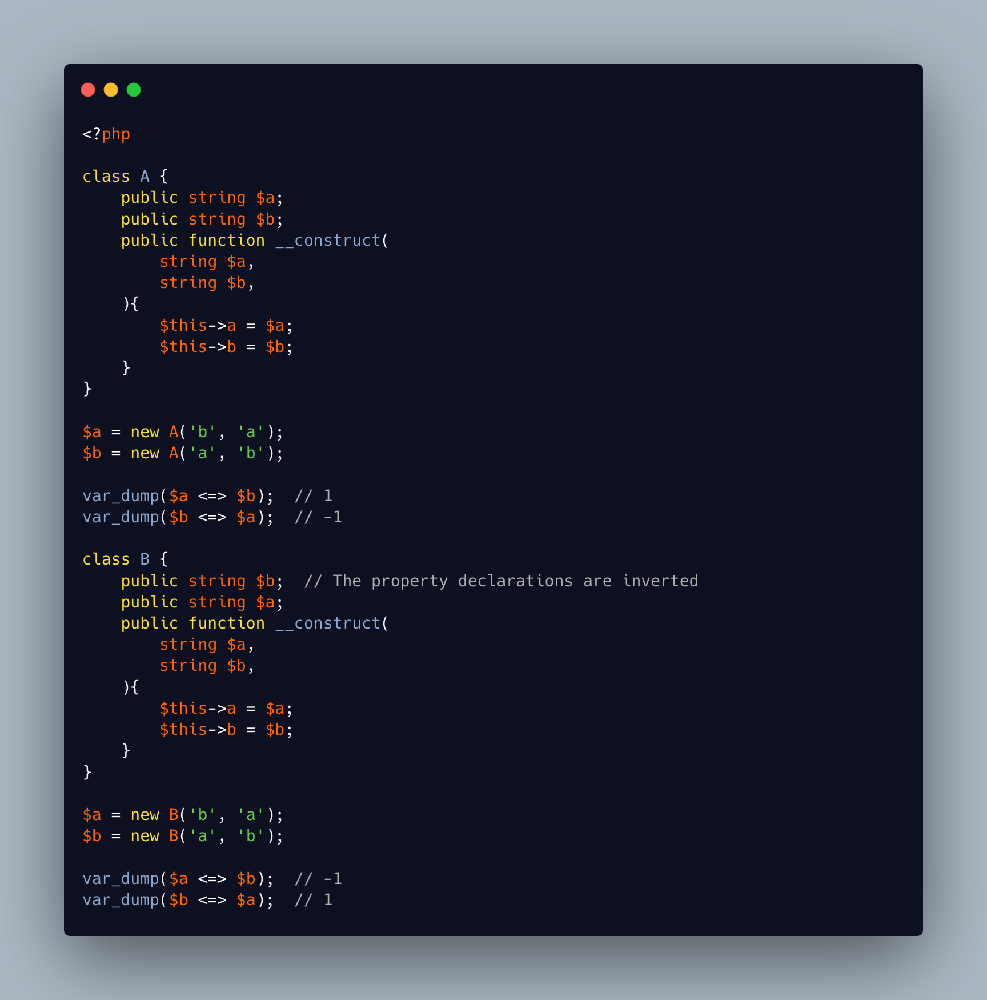

.. _inverted-spaceship-results:

Inverted Spaceship Results
--------------------------

.. meta::
	:description:
		Inverted Spaceship Results: In the first class, the properties are declared $a, then $b.
	:twitter:card: summary_large_image
	:twitter:site: @exakat
	:twitter:title: Inverted Spaceship Results
	:twitter:description: Inverted Spaceship Results: In the first class, the properties are declared $a, then $b
	:twitter:creator: @exakat
	:twitter:image:src: https://php-tips.readthedocs.io/en/latest/_images/inverted-spaceship.png
	:og:image: https://php-tips.readthedocs.io/en/latest/_images/inverted-spaceship.png
	:og:title: Inverted Spaceship Results
	:og:type: article
	:og:description: In the first class, the properties are declared $a, then $b
	:og:url: https://php-tips.readthedocs.io/en/latest/tips/inverted-spaceship.html
	:og:locale: en

.. raw:: html

	

In the first class, the properties are declared $a, then $b. Comparing the values with spaceship leads to 1, -1.

In the first class, the properties are declared $b, then $a. The rest of the code is the same. Comparing the values with spaceship leads to -1, 1.

This phenomenon disappears when using promoted properties.

See Also
________

* `Order of properties matter <https://3v4l.org/2nPL6#veol>`_ [Try me]
* `Order of promoted properties doesn't matter' <https://3v4l.org/E6G8f#veol>`_ [Try me]

PHP Features
____________

* `promoted-properties <https://php-dictionary.readthedocs.io/en/latest/dictionary/promoted-properties.ini.html>`_

* `spaceship <https://php-dictionary.readthedocs.io/en/latest/dictionary/spaceship.ini.html>`_

* `declaration <https://php-dictionary.readthedocs.io/en/latest/dictionary/declaration.ini.html>`_

* `order-of-execution <https://php-dictionary.readthedocs.io/en/latest/dictionary/order-of-execution.ini.html>`_

