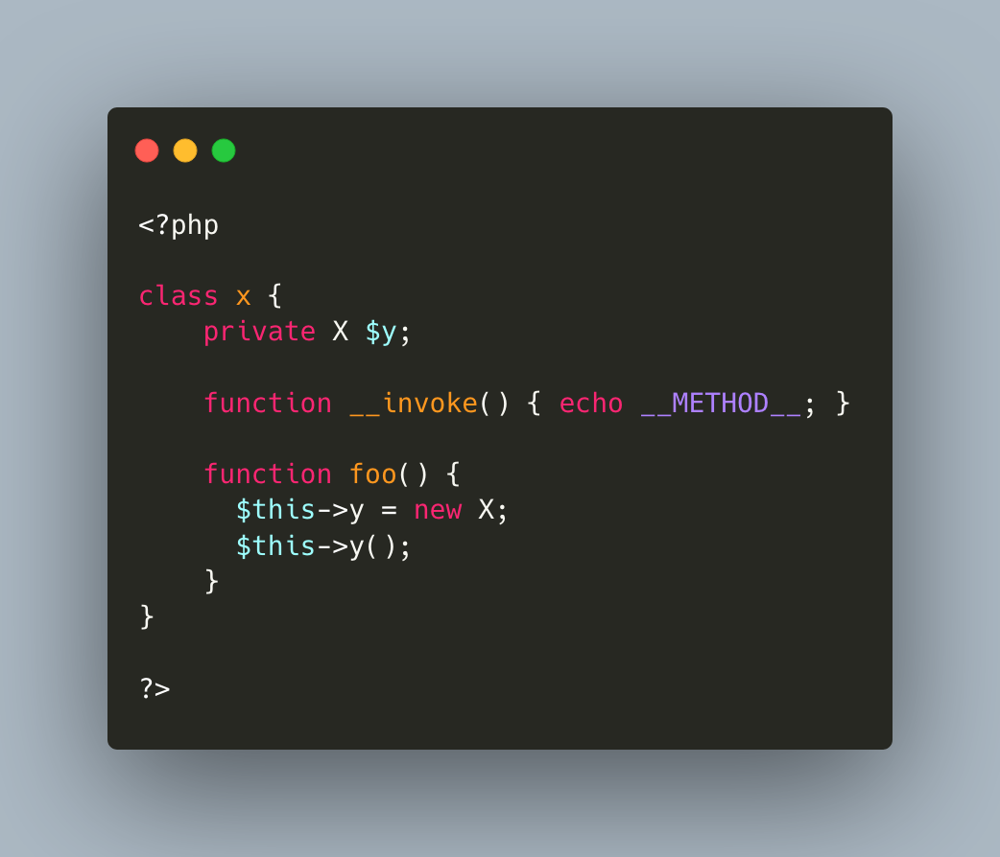

.. ___invoke()-method-and-properties:

__invoke() Method And Properties
--------------------------------

	.. meta::
		:description lang=en:
			__invoke() Method And Properties: In the code here, the __invoke() makes the class ``X`` invokable : the object may be used as a function name and it will call the magic method ``__invoke``.

In the code here, the __invoke() makes the class ``X`` invokable : the object may be used as a function name and it will call the magic method ``__invoke``.

Then, in the same class, there is a property ``$y``, with the type of ``X``. That property is, hence, holding an invokable object. So, may be, it is possible to call this property as a method, and invoke it?

Well, no. This call will yield an error, ``undefined method y``. PHP doesn't use the __invoke() here, as it would conflict with an existing ``y`` method. Also, that would make a case-sensitive method, as the property ``$Y`` doesn't exists.

To invoke the object in the proeprty ``y``, one has to put parenthesis around the object, so that PHP can extract the object and then, invoke it safely.

* `__invoke() (PHP manual) <https://www.php.net/manual/en/language.oop5.magic.php#object.invoke>`_

