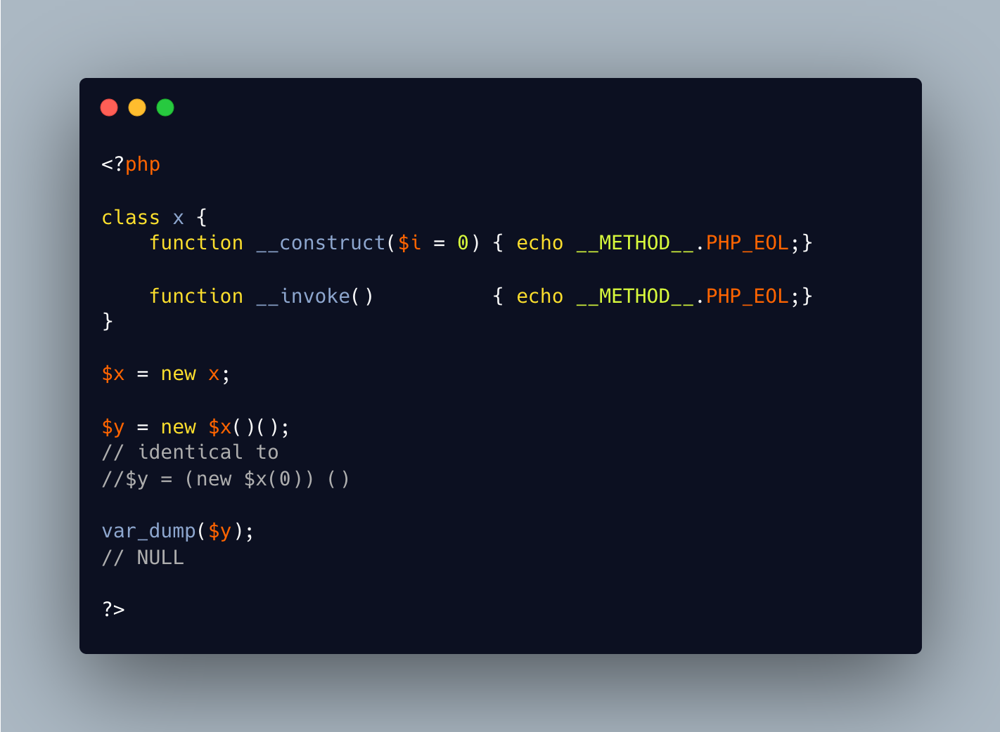

.. ___invoke()-on-new:

__invoke() On New
-----------------

.. meta::
	:description:
		__invoke() On New: It is possible to create a new object by calling new on a previous object: PHP fetches the name of the class, then its constructor.
	:twitter:card: summary_large_image
	:twitter:site: @exakat
	:twitter:title: __invoke() On New
	:twitter:description: __invoke() On New: It is possible to create a new object by calling new on a previous object: PHP fetches the name of the class, then its constructor
	:twitter:creator: @exakat
	:twitter:image:src: https://php-tips.readthedocs.io/en/latest/_images/invoke_on_new.png
	:og:image: https://php-tips.readthedocs.io/en/latest/_images/invoke_on_new.png
	:og:title: __invoke() On New
	:og:type: article
	:og:description: It is possible to create a new object by calling new on a previous object: PHP fetches the name of the class, then its constructor
	:og:url: https://php-tips.readthedocs.io/en/latest/tips/invoke_on_new.html
	:og:locale: en

.. raw:: html

	

It is possible to create a new object by calling new on a previous object: PHP fetches the name of the class, then its constructor.

With the PHP 8.4 new syntax without parenthesis, it is also possible to chain the instantiation with a direct call. This calls the ``__invoke`` method.

This was not possible in previous versions.

See Also
________

* `invoke on new <https://3v4l.org/7G8C7>`_

