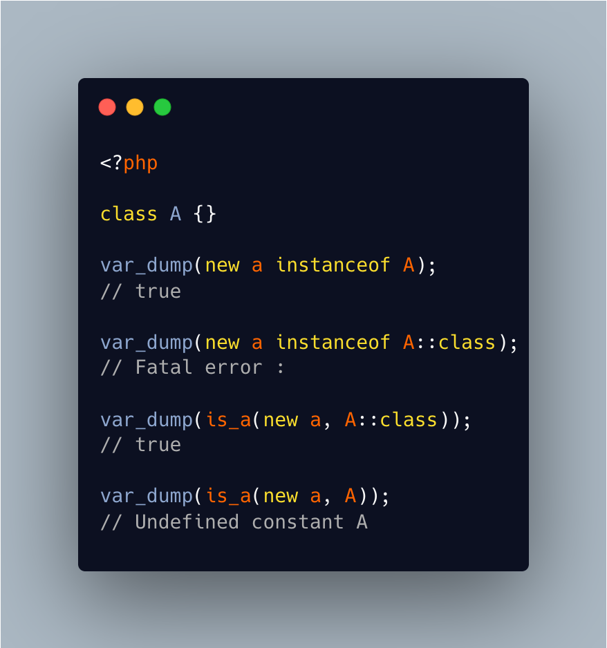

.. _is_a()-versus-instanceof:

is_a() Versus Instanceof
------------------------

.. meta::
	:description:
		is_a() Versus Instanceof: is_a() and instanceof are the same feature: check if an object is of a specific class.
	:twitter:card: summary_large_image
	:twitter:site: @exakat
	:twitter:title: is_a() Versus Instanceof
	:twitter:description: is_a() Versus Instanceof: is_a() and instanceof are the same feature: check if an object is of a specific class
	:twitter:creator: @exakat
	:twitter:image:src: https://php-tips.readthedocs.io/en/latest/_images/is_a_and_instanceof.png
	:og:image: https://php-tips.readthedocs.io/en/latest/_images/is_a_and_instanceof.png
	:og:title: is_a() Versus Instanceof
	:og:type: article
	:og:description: is_a() and instanceof are the same feature: check if an object is of a specific class
	:og:url: https://php-tips.readthedocs.io/en/latest/tips/is_a_and_instanceof.html
	:og:locale: en

.. raw:: html

	

is_a() and instanceof are the same feature: check if an object is of a specific class. Yet, they do things in different ways.

Using the ::class operator is safe in both cases.

Using a name is a class name for instanceof, while it is a constant name with is_a(). This may lead to confusion.

See Also
________

* `is_a (PHP manual) <https://www.php.net/manual/en/is_a.php>`_
* `type operators (PHP manual) <https://www.php.net/manual/en/language.operators.type.php#language.operators.type>`_
* `is_a and instanceof are in a boat... <https://3v4l.org/ojvjm>`_ [Try me]

PHP Features
____________

* `type <https://php-dictionary.readthedocs.io/en/latest/dictionary/type.ini.html>`_

* `instanceof <https://php-dictionary.readthedocs.io/en/latest/dictionary/instanceof.ini.html>`_

* `is_a <https://php-dictionary.readthedocs.io/en/latest/dictionary/is_a.ini.html>`_

