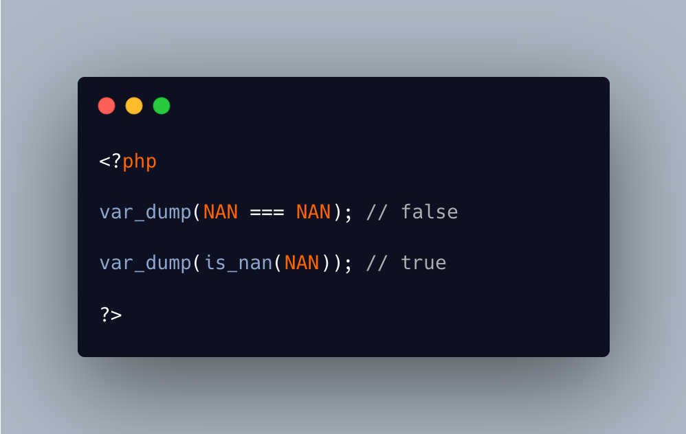

.. _is-not-a-nan:

Is Not A NAN
------------

.. meta::
	:description:
		Is Not A NAN: NAN is a special PHP constant, which represents ``not-a-number``: it is returned when a math function cannot calculate a value because it is out of its domain of application.
	:twitter:card: summary_large_image
	:twitter:site: @exakat
	:twitter:title: Is Not A NAN
	:twitter:description: Is Not A NAN: NAN is a special PHP constant, which represents ``not-a-number``: it is returned when a math function cannot calculate a value because it is out of its domain of application
	:twitter:creator: @exakat
	:twitter:image:src: https://php-tips.readthedocs.io/en/latest/_images/is_not_a_nan.png
	:og:image: https://php-tips.readthedocs.io/en/latest/_images/is_not_a_nan.png
	:og:title: Is Not A NAN
	:og:type: article
	:og:description: NAN is a special PHP constant, which represents ``not-a-number``: it is returned when a math function cannot calculate a value because it is out of its domain of application
	:og:url: https://php-tips.readthedocs.io/en/latest/tips/is_not_a_nan.html
	:og:locale: en

.. raw:: html

	

NAN is a special PHP constant, which represents ``not-a-number``: it is returned when a math function cannot calculate a value because it is out of its domain of application. For example, ``acos(3)`` returns ``NAN``, because ``cos()`` produces values between -1 and 1.

One special situation with NAN is that it is always different from anything.So, it cannot even compare to itself.

Also, ``NAN`` is a float.

See Also
________

* `NAN (PHP manual) <https://www.php.net/manual/en/math.constants.php#constant.nan>`_
* `is_nan (PHP manual) <https://www.php.net/manual/en/function.is-nan.php>`_
* `NAN !== NAN <https://3v4l.org/Hb5EI>`_ [Try me]

