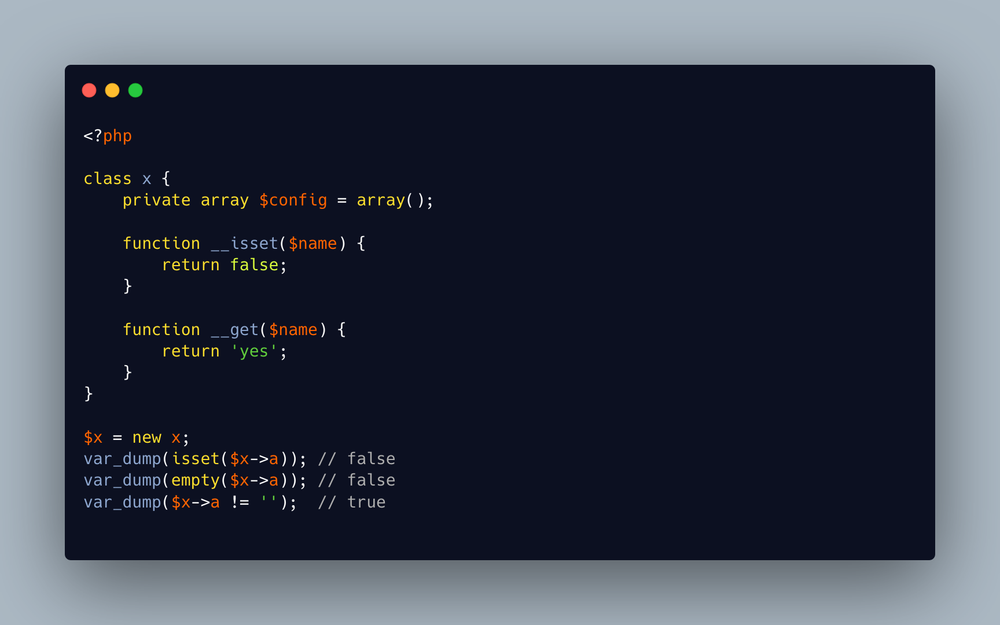

.. _isset(),-empty()-and-the-magic-methods:

isset(), empty() And the Magic Methods
--------------------------------------

.. meta::
	:description:
		isset(), empty() And the Magic Methods: The ``__isset()`` and ``__get()`` methods must go hand in hand.
	:twitter:card: summary_large_image
	:twitter:site: @exakat
	:twitter:title: isset(), empty() And the Magic Methods
	:twitter:description: isset(), empty() And the Magic Methods: The ``__isset()`` and ``__get()`` methods must go hand in hand
	:twitter:creator: @exakat
	:twitter:image:src: https://php-tips.readthedocs.io/en/latest/_images/isset-empty-valued.png
	:og:image: https://php-tips.readthedocs.io/en/latest/_images/isset-empty-valued.png
	:og:title: isset(), empty() And the Magic Methods
	:og:type: article
	:og:description: The ``__isset()`` and ``__get()`` methods must go hand in hand
	:og:url: https://php-tips.readthedocs.io/en/latest/tips/isset-empty-valued.html
	:og:locale: en

.. raw:: html

	

The ``__isset()`` and ``__get()`` methods must go hand in hand. One checks that a property, virtual or not, is available, and the other one returns the actual value. Yet, both may be inconsistent one with the other.

In particular, ``__isset()`` is called when dealing with ``isset()`` and ``empty()``.

But ``__get()`` may be called directly, and return something, even if ``__isset()`` is saying it's not set.

This might come as a surprise to pieces of code that compare a property with ``== ''`` (or equivalent), compared to using ``isset()``.

Beyond the strange illustration, it is probably a good practice to always provide ``__isset()`` on a class that has the magic method ``__get``.

See Also
________

* `isset, empty and get are on a boat <https://3v4l.org/Eiumt>`_ [Try me]

PHP Features
____________

* `__get <https://php-dictionary.readthedocs.io/en/latest/dictionary/__get.ini.html>`_

* `__isset <https://php-dictionary.readthedocs.io/en/latest/dictionary/__isset.ini.html>`_

* `empty <https://php-dictionary.readthedocs.io/en/latest/dictionary/empty.ini.html>`_

* `isset <https://php-dictionary.readthedocs.io/en/latest/dictionary/isset.ini.html>`_

