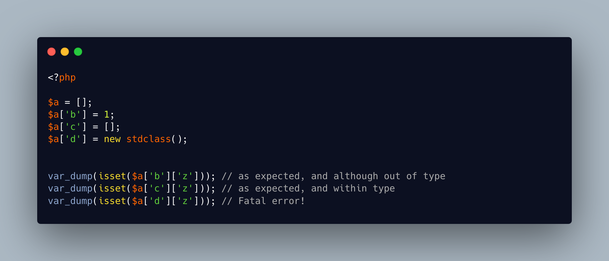

.. _isset()-and-the-fatal-error:

isset() And The Fatal Error
---------------------------

.. meta::
	:description:
		isset() And The Fatal Error: isset() checks if a variable exists.
	:twitter:card: summary_large_image
	:twitter:site: @exakat
	:twitter:title: isset() And The Fatal Error
	:twitter:description: isset() And The Fatal Error: isset() checks if a variable exists
	:twitter:creator: @exakat
	:twitter:image:src: https://php-tips.readthedocs.io/en/latest/_images/isset_and_the_fatal_error.png
	:og:image: https://php-tips.readthedocs.io/en/latest/_images/isset_and_the_fatal_error.png
	:og:title: isset() And The Fatal Error
	:og:type: article
	:og:description: isset() checks if a variable exists
	:og:url: https://php-tips.readthedocs.io/en/latest/tips/isset_and_the_fatal_error.html
	:og:locale: en

.. raw:: html

	

isset() checks if a variable exists. By extension, it also checks array elements, object properties etc. As the check is performed, any attempt to access an undefined part of the expression is muted: this makes total sense.

For example, if one of the intermediate expression is an integer, it is not possible to access it with an array syntax, unlike an array or a string. Such access is a warning when used outside isset(), but is silent inside the isset().

This leads to a nice optimisation, where checking ``isset($a[1][2][3][4])`` is sufficient to check ``isset($a)``, then ``isset($a[1])``, ``isset($a[1][2])``, ``isset($a[1][2][3])``, and ``isset($a[1][2][3][4])``. Nice.

The catch is when of the element inside the actual array is an object. PHP reports a fatal error when using an object with an array syntax (except may be for ``ArrayAccess`` objects). Then, isset() stops.

The reverse is not true: accessing an array with a object syntax yields a null and no warning. As it should be.

All this also applies to empty().

A change of behavior was suggested for PHP 8.5, but was down voted. May be in PHP 8.6?

See Also
________

* `empty (PHP manual) <https://www.php.net/manual/en/function.empty.php>`_
* `isset (PHP manual) <https://www.php.net/manual/en/function.isset.php>`_
* `PHP RFC: Warnings for PHP 8.5 <https://wiki.php.net/rfc/warnings-php-8-5>`_
* `Don't use array syntax on objects in isset() <https://3v4l.org/81sh5>`_ [Try me]

PHP Error Messages
__________________

* `Cannot use object of type stdClass as array <https://php-errors.readthedocs.io/en/latest/messages/cannot-use-object-of-type-%25s-as-array.html>`_

PHP Features
____________

* `isset <https://php-dictionary.readthedocs.io/en/latest/dictionary/isset.ini.html>`_

* `empty <https://php-dictionary.readthedocs.io/en/latest/dictionary/empty.ini.html>`_

* `object-syntax <https://php-dictionary.readthedocs.io/en/latest/dictionary/object-syntax.ini.html>`_

* `array-syntax <https://php-dictionary.readthedocs.io/en/latest/dictionary/array-syntax.ini.html>`_

* `arrayaccess <https://php-dictionary.readthedocs.io/en/latest/dictionary/arrayaccess.ini.html>`_

