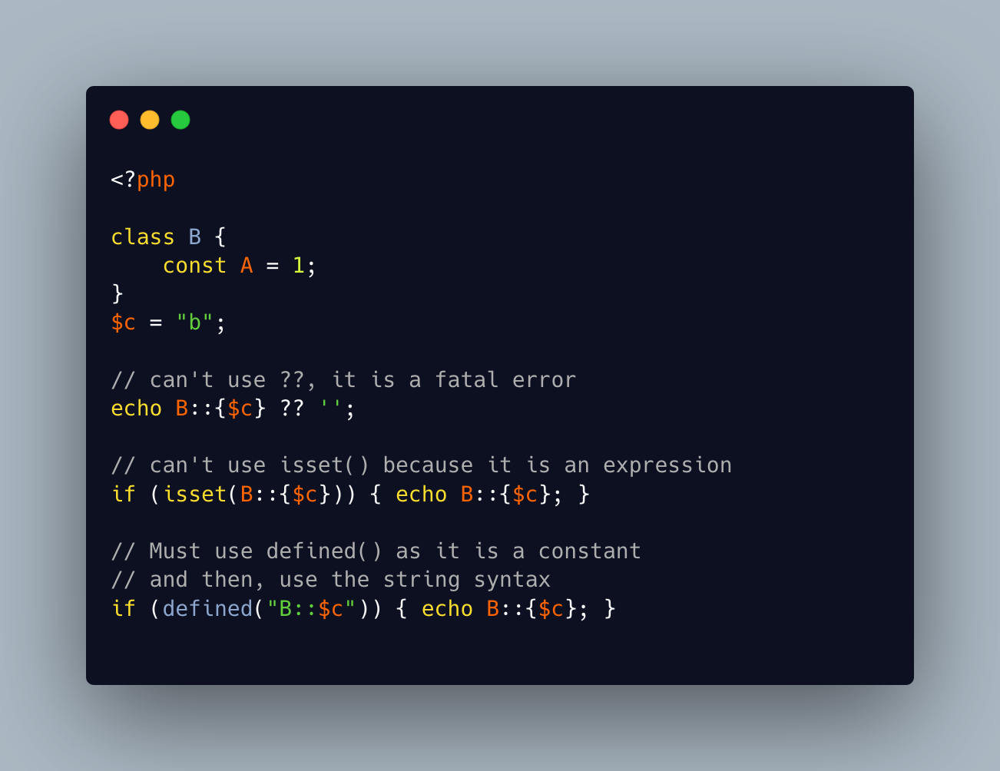

.. _is-a-class-constant-set?:

Is A Class Constant Set?
------------------------

.. meta::
	:description:
		Is A Class Constant Set?: When using a dynamic class constant, it is important to check if the constant is actually defined.
	:twitter:card: summary_large_image
	:twitter:site: @exakat
	:twitter:title: Is A Class Constant Set?
	:twitter:description: Is A Class Constant Set?: When using a dynamic class constant, it is important to check if the constant is actually defined
	:twitter:creator: @exakat
	:twitter:image:src: https://php-tips.readthedocs.io/en/latest/_images/isset_class_constant.png
	:og:image: https://php-tips.readthedocs.io/en/latest/_images/isset_class_constant.png
	:og:title: Is A Class Constant Set?
	:og:type: article
	:og:description: When using a dynamic class constant, it is important to check if the constant is actually defined
	:og:url: https://php-tips.readthedocs.io/en/latest/tips/isset_class_constant.html
	:og:locale: en

.. raw:: html

	

When using a dynamic class constant, it is important to check if the constant is actually defined.

It is not possible to use the coalesce ``??`` operator, as a non-existent class constant yields a fatal error.

Then, it is not possible to use ``isset()``, because a dynamic class constant is actually an expression. The error message is actually misleading, as the offered solution is not available.

The only solution is to use the ``defined()`` method, which is made to check constants. In the case of a class constant, one need to use the string syntax, and should not use the class constant syntax.

See Also
________

* `defined (PHP manual) <https://www.php.net/manual/en/function.defined.php>`_
* `Class Constant Check <https://3v4l.org/pNPQG>`_ [Try me]

PHP Error Messages
__________________

* `Cannot use isset() on the result of an expression (you can use "null !== expression" instead) <https://php-errors.readthedocs.io/en/latest/messages/cannot-use-isset%28%29-on-the-result-of-an-expression-%28you-can-use-%22null-%21%3D%3D-expression%22-instead%29.html>`_

PHP Features
____________

* `isset <https://php-dictionary.readthedocs.io/en/latest/dictionary/isset.ini.html>`_

* `coalesce <https://php-dictionary.readthedocs.io/en/latest/dictionary/coalesce.ini.html>`_

* `class-constant <https://php-dictionary.readthedocs.io/en/latest/dictionary/class-constant.ini.html>`_

* `dynamic-class-constant <https://php-dictionary.readthedocs.io/en/latest/dictionary/dynamic-class-constant.ini.html>`_

