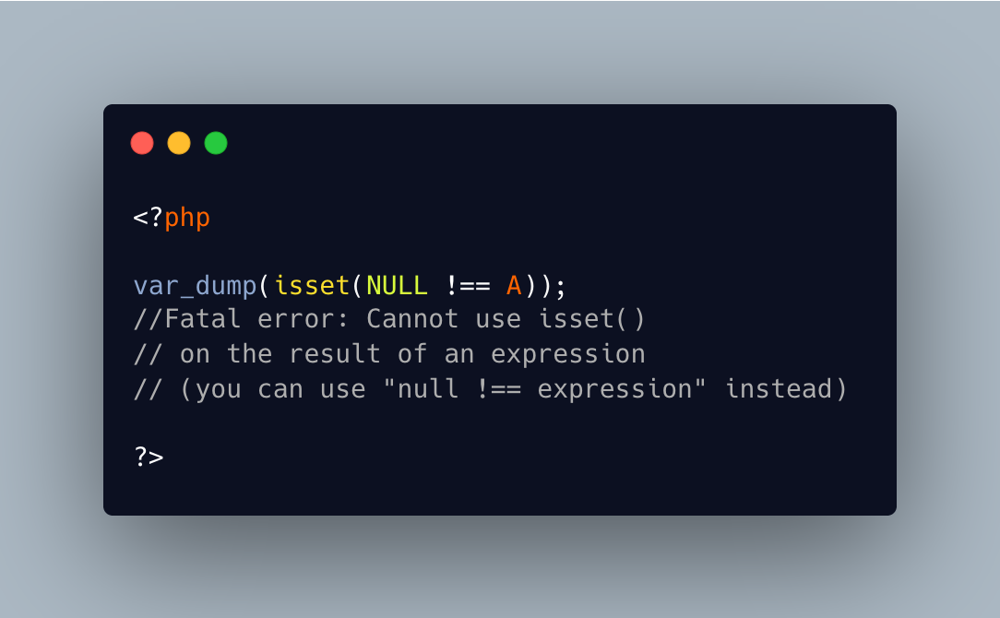

.. _cannot-use-isset-on-expression,-so-use-what?:

Cannot Use Isset On Expression, So Use What?
--------------------------------------------

.. meta::
	:description:
		Cannot Use Isset On Expression, So Use What?: isset() works on data containers, such as variable, properties, array elements, but not on literal or constant values.
	:twitter:card: summary_large_image
	:twitter:site: @exakat
	:twitter:title: Cannot Use Isset On Expression, So Use What?
	:twitter:description: Cannot Use Isset On Expression, So Use What?: isset() works on data containers, such as variable, properties, array elements, but not on literal or constant values
	:twitter:creator: @exakat
	:twitter:image:src: https://php-tips.readthedocs.io/en/latest/_images/isset_on_expression.png
	:og:image: https://php-tips.readthedocs.io/en/latest/_images/isset_on_expression.png
	:og:title: Cannot Use Isset On Expression, So Use What?
	:og:type: article
	:og:description: isset() works on data containers, such as variable, properties, array elements, but not on literal or constant values
	:og:url: https://php-tips.readthedocs.io/en/latest/tips/isset_on_expression.html
	:og:locale: en

isset() works on data containers, such as variable, properties, array elements, but not on literal or constant values.

For literal values, it is recommended to avoid using isset, but make a comparison to ``null``, instead.

And of course, the error message is the same when the code uses both solutions at the same time. This may lead to confusion: the message suggests using ``null !== (NULL !== A)``, instead of ``isset(NULL !== A)``.

* `Isset (PHP manual) <https://www.php.net/isset>`_
* `Cannot use isset() on the result of an expression (you can use "null !== expression" instead) <https://php-errors.readthedocs.io/en/latest/messages/cannot-use-isset%28%29-on-the-result-of-an-expression-%28you-can-use-%22null-%21%3D%3D-expression%22-instead%29.html>`_

