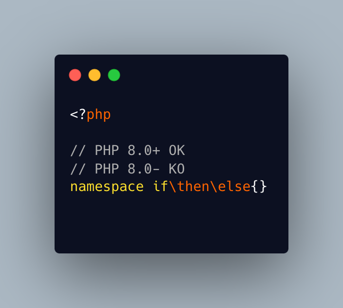

.. _keywords-in-namespaces:

Keywords In Namespaces
----------------------

	.. meta::
		:description lang=en:
			Keywords In Namespaces: Since PHP 8.

Since PHP 8.0, it is possible to use PHP keywords in namespaces.

In PHP 8.0, namespaces are processed independently, for their literal value. Before then, each namespace level was a distinct token, separated by the namespace separator: PHP keyword would then run into a processing conflict. 

The last keyword that one can't still use in a namespace is namespace, when used as the first part of the namespace : it is later replaced dynamically by the current namespace.

* `Namespaces (PHP manual) <https://www.php.net/manual/en/language.namespaces.php>`_

