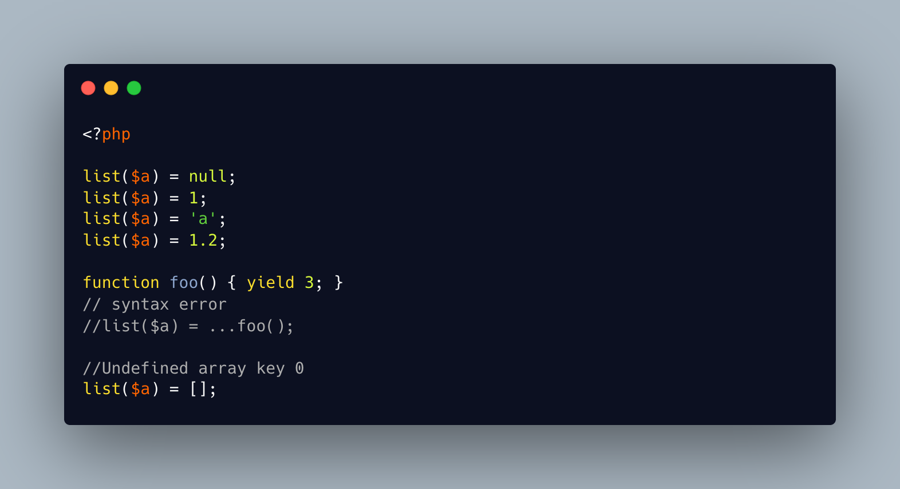

.. _list()-does-not-type:

list() Does Not Type
--------------------

.. meta::
	:description:
		list() Does Not Type: The list() command does not report that the type of the right operand is not correct.
	:twitter:card: summary_large_image
	:twitter:site: @exakat
	:twitter:title: list() Does Not Type
	:twitter:description: list() Does Not Type: The list() command does not report that the type of the right operand is not correct
	:twitter:creator: @exakat
	:twitter:image:src: https://php-tips.readthedocs.io/en/latest/_images/list_does_not_type.png
	:og:image: https://php-tips.readthedocs.io/en/latest/_images/list_does_not_type.png
	:og:title: list() Does Not Type
	:og:type: article
	:og:description: The list() command does not report that the type of the right operand is not correct
	:og:url: https://php-tips.readthedocs.io/en/latest/tips/list_does_not_type.html
	:og:locale: en

.. raw:: html

	

The list() command does not report that the type of the right operand is not correct. It is then possible to use ``list()`` with integers, string or boolean, and obtain ``null`` values for all variables.

On the other hand, ``list()`` does complain if the right hand array does not contain enough values to fit the number of variables. It also produces a Fatal error with an object, because an object cannot be used as an array.

Finally, ``list()`` does not compile with an ellipsis ``...`` on the right side. To convert a ``Generator`` into a list of variables, one need to use ``iterator_to_array()`` first.

See Also
________

* `iterator_to_array (PHP manual) <https://www.php.net/manual/en/function.iterator-to-array.php>`_
* `List (PHP manual) <https://www.php.net/manual/en/function.list.php>`_
* `list() with all sorts of types <https://3v4l.org/SkKon>`_

